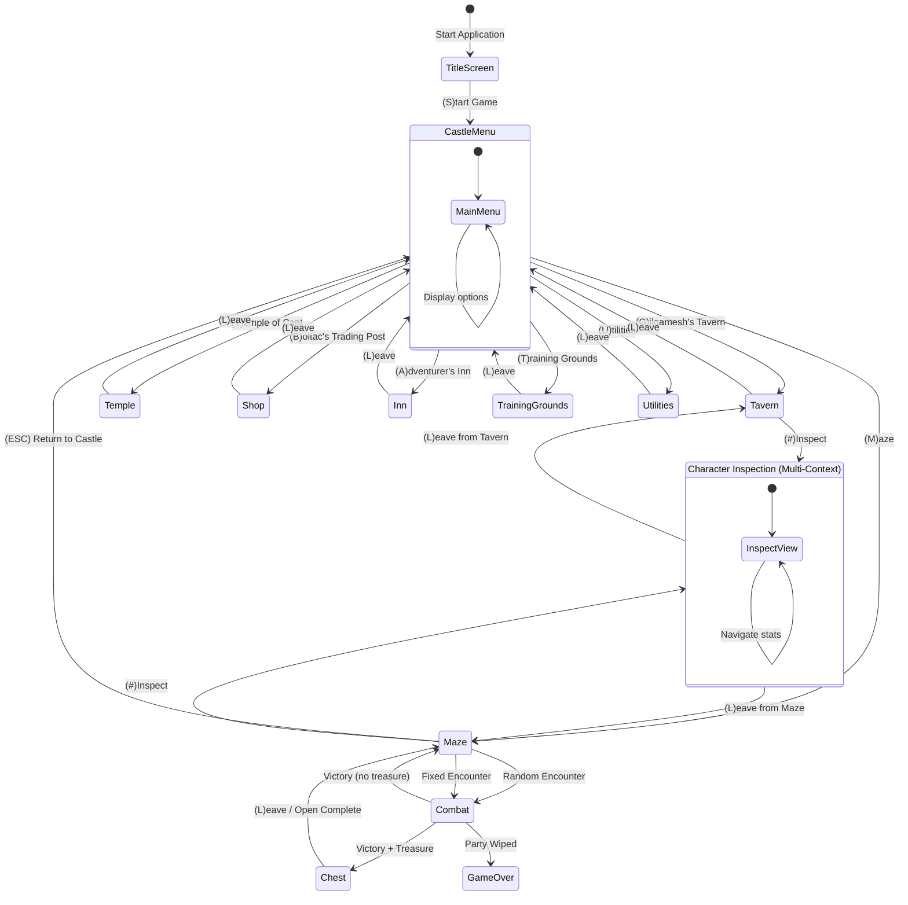

# UI Navigation Map

**Complete navigation flow for all 13 scenes.**

---

## Overview

Wizardry 1 uses a **hub-and-spoke navigation model** with Castle Menu as the central hub. All town services are accessed through the Castle, while dungeon access goes through Edge of Town.

**Navigation Principles:**
- **Single-keystroke navigation:** Press first letter of action (no Enter needed)
- **Case-insensitive:** 'G' and 'g' both work
- **Invalid keys:** Beep or error message
- **Context-sensitive:** Some keys mean different things in different scenes

---

## Complete Navigation Diagram



---

## Scene Categories

### Safe Zone (Auto-save on entry)
- Title Screen
- Castle Menu (central hub)
- Training Grounds
- Gilgamesh's Tavern
- Boltac's Trading Post
- Temple of Cant
- Adventurer's Inn
- Utilities Menu

### Dungeon Zone (No auto-save)
- Maze (exploration) - auto-saves on entry from Castle
- Combat (battles)
- Chest (treasure)

### Multi-Context
- Character Inspection (adapts based on parent scene)

---

## Navigation Patterns

### Hub Navigation (from Castle Menu)

```
Castle Menu (Central Hub)
├─ (A) → Gilgamesh's Tavern → (ESC) → Castle Menu
├─ (T) → Temple of Cant → (ESC) → Castle Menu
├─ (S) → Boltac's Trading Post → (ESC) → Castle Menu
├─ (I) → Adventurer's Inn → (ESC) → Castle Menu
├─ (G) → Training Grounds → (ESC) → Castle Menu
└─ (M) → Maze → (ESC) → Castle Menu
```

### Dungeon Entry Flow

```
Castle Menu
  → (M) Maze (auto-saves before entry)
    → Random/Fixed Encounter → Combat
      → Victory → Chest (optional)
        → Maze
    → (ESC) Castle Menu
```

### Character Inspection (Context-Aware)

```
From Tavern:
  Tavern → (#) → Inspection → (L) → Tavern

From Maze:
  Maze → (#) → Inspection → (L) → Maze
```

---

## State-Based Navigation Rules

### Castle Menu Access

**Requirements:**
- Party NOT in maze
- Auto-saves on entry

**Restrictions:**
- Cannot access if party is IN_MAZE status
- Must return to Edge of Town first via LOKTOFEIT spell or death

### Dungeon Entry

**Requirements:**
- Party formed (1-6 characters)
- All party members OK or wounded (not dead/ashes/lost)
- Party NOT already in maze

**Restrictions:**
- Cannot enter with dead party members
- Cannot re-enter if already IN_MAZE

### Town Services

**Requirements vary by service:**
- **Temple:** Need dead/ashes/afflicted characters to heal
- **Shop:** Need gold to buy
- **Inn:** Need characters to level up or rest
- **Training Grounds:** No restrictions (can always create)

---

## Navigation Keys Reference

### Universal Keys (available in most scenes)

| Key | Action | Context |
|-----|--------|---------|
| (ESC) | Leave | Returns to parent scene |
| (#) | Inspect Character | Available in Tavern, Maze |
| (?) | Help | Context-sensitive help (if implemented) |

### Castle Menu Keys

| Key | Action | Destination |
|-----|--------|-------------|
| (A) | Gilgamesh's Tavern | Party formation |
| (T) | Temple of Cant | Healing/resurrection |
| (S) | Boltac's Trading Post | Buy/sell items |
| (I) | Adventurer's Inn | Rest/level up |
| (G) | Training Grounds | Create characters |
| (M) | Maze | Enter dungeon directly |

### Maze Keys

| Key | Action | Effect |
|-----|--------|--------|
| (W) | Forward | Move forward one tile |
| (A) | Turn Left | Rotate 90° left |
| (S) | Backward | Move backward one tile |
| (D) | Turn Right | Rotate 90° right |
| (Q) | Strafe Left | Move left without turning |
| (E) | Strafe Right | Move right without turning |
| (ESC) | Castle | Return to Castle Menu |
| (O) | Open Door | Open door ahead |
| (I) | Inspect Tile | Inspect current tile |

---

## Error Handling

### Invalid Navigation Attempts

**Scenario:** User tries to enter dungeon with dead party member

**Response:**
```
YOU CANNOT ENTER THE DUNGEON WITH DEAD PARTY MEMBERS.
VISIT THE TEMPLE FIRST.
```

**Scenario:** User tries to access Castle Menu while IN_MAZE

**Response:**
```
YOUR PARTY IS IN THE MAZE.
YOU MUST RETURN TO TOWN FIRST.
```

**Scenario:** User presses invalid key in menu

**Response:**
```
[BEEP]
INVALID SELECTION
```

---

## Implementation Notes

### Navigation Service

```typescript
interface NavigationService {
  canNavigateTo(from: SceneType, to: SceneType, state: GameState): NavigationResult
  navigate(from: SceneType, to: SceneType, state: GameState): GameState
  getAvailableActions(scene: SceneType, state: GameState): Action[]
}

interface NavigationResult {
  allowed: boolean
  reason?: string
  warning?: string
}
```

### State Transitions

**Safe transitions (always save before):**
- Any scene → Castle Menu
- Castle Menu → Any town service
- Castle Menu → Maze (auto-saves before entry)

**Risky transitions (no save):**
- Maze → Combat
- Combat → anywhere (depends on outcome)

### Navigation Commands

- `NavigateToSceneCommand` - Generic scene transition
- `EnterDungeonCommand` - Special validation for maze entry
- `ReturnToTownCommand` - Special handling for LOKTOFEIT or death
- `LeaveGameCommand` - Save and exit

---

## Related Documentation

- [UI Patterns](./ui-patterns.md) - Reusable menu patterns
- [State Management](./state-management.md) - State transition rules
- [Individual Scenes](./scenes/) - Detailed scene documentation
