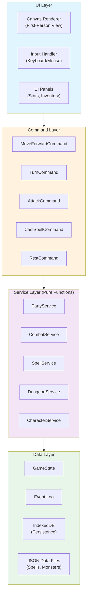

# Architecture Layers Diagram

**Visual representation of the 4-layer architecture.**

## Description

The Wizardry remake uses a clean 4-layer architecture:

1. **UI Layer**: Canvas rendering, user input
2. **Command Layer**: Action orchestration
3. **Service Layer**: Business logic (pure functions)
4. **Data Layer**: State storage, event log, persistence

Each layer only communicates with the layer below (no skipping layers).

## Diagram

## Layer Responsibilities

**UI Layer**:
- Render first-person dungeon view
- Display party stats, combat UI
- Handle user input (keyboard, mouse)
- Trigger commands based on input

**Command Layer**:
- Orchestrate service calls
- Validate command preconditions
- Create events for event log
- Return new game state

**Service Layer**:
- Pure functions (no side effects)
- Business logic implementation
- State transformations
- Calculations (combat, spells, etc.)

**Data Layer**:
- Game state storage
- Event log (for replay)
- IndexedDB persistence
- Static data files (JSON)

## Communication Flow

User Input → Command → Service(s) → New State → UI Update

**Example: Move Forward**
1. User presses 'W'
2. Input handler triggers MoveForwardCommand
3. Command calls PartyService.moveForward(state)
4. PartyService returns new state with updated position
5. Command adds MoveEvent to event log
6. UI re-renders with new party position
