# Character Creation Flow Diagram

**Visual representation of character creation steps.**

## Description

Character creation in Wizardry 1 follows a structured flow:

1. **Roll Attributes**: Random stat generation with bonus points
2. **Choose Race**: Based on stat requirements
3. **Choose Class**: Based on race and stats
4. **Choose Alignment**: Good, Neutral, or Evil
5. **Choose Name**: Player-entered name
6. **Confirm**: Finalize and add to roster

The process includes reroll options and validation at each step.

## Character Creation Flowchart

```mermaid
flowchart TD
    Start([Start Character Creation]) --> RollStats

    subgraph StatGeneration["Attribute Generation"]
        direction TB
        RollStats["Roll Base Attributes<br/>(3d6 for each stat)"]
        RollBonus["Roll Bonus Points<br/>(1d4+6 = 7-10 base)"]
        BonusCheck1{"Random(1-11) = 1?<br/>(9.09% chance)"}
        AddBonus1["Add +10 bonus<br/>(17-20 total)"]
        BonusCheck2{"Roll < 20 AND<br/>Random(1-11) = 1?"}
        AddBonus2["Add +10 bonus<br/>(27-29 total)"]
        AllocatePoints["Allocate Bonus Points<br/>to Attributes (STR/INT/PIE/VIT/AGI/LUC)"]

        RollStats --> RollBonus
        RollBonus --> BonusCheck1
        BonusCheck1 -->|Yes| AddBonus1
        BonusCheck1 -->|No| BonusCheck2
        AddBonus1 --> BonusCheck2
        BonusCheck2 -->|Yes| AddBonus2
        BonusCheck2 -->|No| AllocatePoints
        AddBonus2 --> AllocatePoints
    end

    StatGeneration --> ReviewStats

    ReviewStats{"Satisfied with<br/>Stats?"}
    ReviewStats -->|No| RollStats
    ReviewStats -->|Yes| ChooseRace

    subgraph RaceSelection["Race Selection"]
        direction TB
        ChooseRace["Display Available Races<br/>(Based on Stat Requirements)"]
        RaceOptions["Options:<br/>Human, Elf, Dwarf,<br/>Gnome, Hobbit"]
        SelectRace["Select Race"]
        ApplyRaceMods["Apply Racial Modifiers<br/>(Stat bonuses/penalties)"]

        ChooseRace --> RaceOptions
        RaceOptions --> SelectRace
        SelectRace --> ApplyRaceMods
    end

    ApplyRaceMods --> ChooseClass

    subgraph ClassSelection["Class Selection"]
        direction TB
        ChooseClass["Display Available Classes<br/>(Based on Race + Stats)"]
        ClassOptions["Options:<br/>Fighter, Mage, Priest, Thief,<br/>Bishop, Samurai, Lord, Ninja"]
        CheckReqs{"Meet Class<br/>Requirements?"}
        SelectClass["Select Class"]
        ApplyClassData["Set Class Data<br/>(HP dice, XP table, spells)"]

        ChooseClass --> ClassOptions
        ClassOptions --> CheckReqs
        CheckReqs -->|Yes| SelectClass
        CheckReqs -->|No| ClassOptions
        SelectClass --> ApplyClassData
    end

    ApplyClassData --> ChooseAlignment

    subgraph AlignmentSelection["Alignment Selection"]
        direction TB
        ChooseAlignment["Display Available Alignments<br/>(Based on Class)"]
        AlignOptions["Good / Neutral / Evil"]
        CheckClassAlign{"Class Allows<br/>Alignment?"}
        SelectAlign["Select Alignment"]

        ChooseAlignment --> AlignOptions
        AlignOptions --> CheckClassAlign
        CheckClassAlign -->|Yes| SelectAlign
        CheckClassAlign -->|No| AlignOptions
    end

    SelectAlign --> EnterName

    subgraph Naming["Character Naming"]
        direction TB
        EnterName["Enter Character Name<br/>(Max 15 characters)"]
        ValidateName{"Name Valid?<br/>(Not empty,<br/>not duplicate)"}
        NameError["Error: Invalid Name"]

        EnterName --> ValidateName
        ValidateName -->|No| NameError
        NameError --> EnterName
    end

    ValidateName -->|Yes| SetInitialValues

    subgraph Initialization["Initial Values"]
        direction TB
        SetInitialValues["Set Initial Values"]
        CalcHP["Calculate Starting HP<br/>(Roll class hit dice + VIT mod)"]
        SetAge["Set Starting Age<br/>(14 + random(0-2) = 14-16)"]
        SetGold["Set Starting Gold (90-150 gp)"]
        SetSpells["Initialize Spell Points<br/>(0 for all levels)"]
        EmptyInv["Empty Inventory"]

        SetInitialValues --> CalcHP
        CalcHP --> SetAge
        SetAge --> SetGold
        SetGold --> SetSpells
        SetSpells --> EmptyInv
    end

    EmptyInv --> ReviewCharacter

    ReviewCharacter["Review Character Summary"]
    ReviewCharacter --> ConfirmCreate{"Confirm<br/>Creation?"}

    ConfirmCreate -->|No| Start
    ConfirmCreate -->|Yes| AddToRoster

    AddToRoster["Add Character to Roster"]
    AddToRoster --> Success([Character Created!])

    Success --> NextAction{"Create Another?"}
    NextAction -->|Yes| Start
    NextAction -->|No| ReturnToTown([Return to Town])

    style Start fill:#c8e6c9
    style Success fill:#a5d6a7
    style ReturnToTown fill:#c8e6c9
    style NameError fill:#ef9a9a
    style StatGeneration fill:#e1f5ff
    style RaceSelection fill:#fff3e0
    style ClassSelection fill:#f3e5f5
    style AlignmentSelection fill:#e8f5e9
    style Naming fill:#fce4ec
    style Initialization fill:#f1f8e9
```



## Detailed Step Breakdown

### Step 1: Attribute Generation

#### Base Stat Roll
```
For each attribute (STR, INT, PIE, VIT, AGI, LUC):
  Roll 3d6 (yields 3-18)
```

#### Bonus Points Roll
```
BonusPoints = 1d4 + 6  (yields 7-10)

If BonusPoints < 20:
  if random(1-11) == 1:  // 9.09% chance
    BonusPoints += 10

If BonusPoints < 20:
  if random(1-11) == 1:  // 9.09% chance
    BonusPoints += 10
```

**Distribution**:
- 7-10 points: 90.0% (most common)
- 17-20 points: 9.25% (first bonus)
- 27-29 points: 0.75% (both bonuses - very rare!)

#### Allocation
Player distributes bonus points to attributes. Can reroll if unsatisfied.

### Step 2: Race Selection

#### Race Requirements & Modifiers

| Race | STR | INT | PIE | VIT | AGI | LUC | Special |
|------|-----|-----|-----|-----|-----|-----|---------|
| Human | - | - | - | - | - | - | No restrictions, no bonuses |
| Elf | - | +1 | - | -1 | +1 | - | Bonus INT, AGI; penalty VIT |
| Dwarf | +1 | - | +1 | +1 | - | -1 | Bonus STR, PIE, VIT; penalty LUC |
| Gnome | - | +1 | +1 | - | - | - | Bonus INT, PIE |
| Hobbit | -1 | +1 | - | - | +2 | +1 | Bonus AGI, LUC; penalty STR |

**Notes**:
- Only races with met requirements shown
- Racial modifiers applied immediately after selection

### Step 3: Class Selection

#### Class Requirements

| Class | STR | INT | PIE | VIT | AGI | LUC | Alignment |
|-------|-----|-----|-----|-----|-----|-----|-----------|
| Fighter | 11+ | - | - | - | - | - | Any |
| Mage | - | 11+ | - | - | - | - | Any |
| Priest | - | - | 11+ | - | - | - | Good/Evil only |
| Thief | - | - | - | - | 11+ | - | Neutral/Evil only |
| Bishop | - | 12+ | 12+ | - | - | - | Good/Evil only |
| Samurai | 15+ | 11+ | 10+ | 14+ | 10+ | - | Good/Neutral only |
| Lord | 15+ | 12+ | 12+ | 15+ | 14+ | 15+ | Good only |
| Ninja | 17+ | 17+ | - | - | 17+ | - | Evil only |

**Elite Classes** (Samurai, Lord, Ninja):
- Highest stat requirements
- Best abilities
- Hardest to create

#### Class Abilities

**Fighter**:
- Hit Dice: 1d10
- Attacks: 1 + floor(Level/5)
- Max attacks: 10

**Mage**:
- Hit Dice: 1d4
- Can cast mage spells (7 levels)
- Learn chance: INT / 30

**Priest**:
- Hit Dice: 1d8
- Can cast priest spells (7 levels)
- Learn chance: PIE / 30

**Thief**:
- Hit Dice: 1d6
- Disarm traps, pick locks
- Hide in shadows (combat escape)

**Bishop**:
- Hit Dice: 1d6
- Can cast BOTH mage AND priest spells
- Slower learning rate (penalty)
- Identify items

**Samurai**:
- Hit Dice: 1d10
- Can cast mage spells
- Fighter attack progression
- Critical hit masters

**Lord**:
- Hit Dice: 1d10
- Can cast priest spells
- Fighter attack progression
- Healers in heavy armor

**Ninja**:
- Hit Dice: 1d8
- Attacks: 2 + floor(Level/5)
- Critical hits can decapitate
- Unarmed damage: 2d4 + STR

### Step 4: Alignment Selection

#### Alignment Restrictions

**Good**:
- Classes: Fighter, Mage, Priest, Bishop, Samurai, Lord
- Cannot party with Evil characters

**Neutral**:
- Classes: Fighter, Mage, Thief, Samurai
- Can party with anyone

**Evil**:
- Classes: Fighter, Mage, Priest, Thief, Bishop, Ninja
- Cannot party with Good characters

**Party Mixing Rules**:
- Good + Neutral: OK
- Neutral + Evil: OK
- Good + Evil: FORBIDDEN

### Step 5: Name Entry

**Requirements**:
- 1-15 characters
- Alphanumeric + spaces
- Not empty
- No duplicates in roster

**Validation**:
- Check length
- Check for duplicate names
- Sanitize input (no special chars)

### Step 6: Initial Values

#### Starting HP
```
HP = HitDice + VIT_Modifier

VIT_Modifier:
  VIT 3-5: -1 HP
  VIT 6-15: 0 HP
  VIT 16-17: +1 HP
  VIT 18+: +2 HP

Minimum HP: 1 (can't go below)
```

#### Starting Age
```
Age = 14 + random(0-2)  // Yields 14-16 years
```

#### Starting Gold
```
Gold = 90 + random(0-60)  // Yields 90-150 gp
```

#### Spell Points
```
All spell levels start at 0 points
(Must level up to gain first spell points)
```

#### Equipment & Inventory
```
Empty slots (all 8)
No starting equipment
(Must buy in shop)
```

### Step 7: Confirmation

**Summary Display**:
- Name, Race, Class, Alignment
- All attributes (STR, INT, PIE, VIT, AGI, LUC)
- Starting HP
- Starting age
- Starting gold

**Options**:
- Confirm: Add to roster → Town
- Cancel: Start over
- Create Another: → New character creation

## Reroll Strategy

### When to Reroll Stats

**For Elite Classes** (Lord, Samurai, Ninja):
- Need very high stats (15-17+ in multiple attributes)
- Bonus roll of 17-29 highly recommended
- May take many attempts (elite classes are rare!)

**For Basic Classes** (Fighter, Mage, Priest, Thief):
- Base stats usually sufficient
- Reroll if all stats below 10

**For Bishop**:
- Need INT 12+ and PIE 12+
- Moderate difficulty

### Optimal Stat Distribution

**Fighter**:
- Prioritize: STR (damage), VIT (HP), AGI (initiative)
- Dump stats: INT, PIE

**Mage**:
- Prioritize: INT (spell learning), AGI (initiative)
- Dump stats: STR, VIT

**Priest**:
- Prioritize: PIE (spell learning), VIT (HP)
- Dump stats: STR, AGI

**Thief**:
- Prioritize: AGI (disarm, stealth), LUC (chest outcomes)
- Dump stats: PIE, INT

**Bishop**:
- Prioritize: INT, PIE (both spell types)
- Dump stats: STR

**Samurai**:
- Balanced (need high stats across the board)
- Don't dump any stat

**Lord**:
- Balanced (highest requirements)
- All stats matter

**Ninja**:
- Prioritize: STR, AGI (combat stats)
- INT required but not primary

## Implementation Notes

### State Tracking

```typescript
interface CharacterCreationState {
  step: 'STATS' | 'RACE' | 'CLASS' | 'ALIGNMENT' | 'NAME' | 'CONFIRM'
  baseStats: Attributes
  bonusPoints: number
  allocatedStats: Attributes
  selectedRace?: Race
  selectedClass?: Class
  selectedAlignment?: Alignment
  characterName?: string
}
```

### Validation Functions

```typescript
function canSelectRace(stats: Attributes, race: Race): boolean {
  // Check if stats meet race requirements (none currently)
  return true
}

function canSelectClass(stats: Attributes, race: Race, cls: Class): boolean {
  // Check stat requirements
  return cls.requirements.every(req => stats[req.stat] >= req.value)
}

function canSelectAlignment(cls: Class, alignment: Alignment): boolean {
  // Check class-alignment compatibility
  return cls.allowedAlignments.includes(alignment)
}
```

## Key Design Points

1. **Guided Flow**: Each step validates before proceeding
2. **Reroll Freedom**: Can restart at any point before confirmation
3. **Clear Requirements**: Show why classes/races unavailable
4. **Elite Class Rarity**: High requirements make Samurai/Lord/Ninja rare
5. **No Save Scumming**: Stats locked once race selected (commitment)
