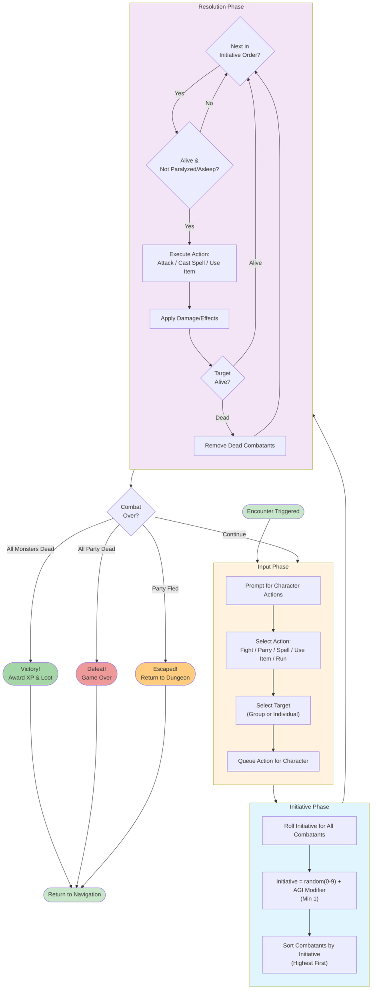

# Combat Flow Diagram

**Visual representation of combat round phases.**

## Description

Wizardry 1 uses round-based combat with three distinct phases:

1. **Input Phase**: Players select actions for each character
2. **Initiative Phase**: Roll initiative for all combatants (party + monsters)
3. **Resolution Phase**: Execute actions in initiative order

Combat continues in rounds until all monsters or all party members are defeated (or flee).

## Diagram



## Combat Round Details

### Input Phase

**For Each Character**:
1. Prompt player for action
2. Actions: Fight (melee), Parry (defend), Spell (cast), Use Item, Run (flee)
3. Select target (enemy group or specific monster)
4. Queue action for resolution

**Notes**:
- All inputs collected before any actions execute
- Can't change actions once initiative rolled
- Back row characters can't use Fight (melee)

### Initiative Phase

**Initiative Formula**:
```
Initiative = random(0-9) + AGI_Modifier
Minimum = 1 (can't go below)
```

**AGI Modifiers**:
- AGI 3: -2 (range 1)
- AGI 4-5: -1 (range 1-9)
- AGI 6-8: 0 (range 1-10)
- AGI 9-11: +1 (range 2-11)
- AGI 12-14: +2 (range 3-12)
- AGI 15-17: +3 (range 4-13)
- AGI 18+: +4 (range 5-14)

**Order**:
- All combatants (party + monsters) rolled together
- Highest initiative goes first
- Ties resolved randomly

### Resolution Phase

**For Each Combatant (Initiative Order)**:
1. Check if alive and able to act
2. Execute queued action
3. Apply damage/effects to target
4. Check if target defeated
5. Remove dead combatants from initiative order

**Action Types**:
- **Fight**: Melee attack (front row only)
- **Parry**: Defensive stance (improves AC this round)
- **Spell**: Cast queued spell
- **Use Item**: Use queued item
- **Run**: Attempt to flee (whole party action)

### Combat End Conditions

**Victory**: All monster groups eliminated
- Award experience points
- Award gold and items
- Return to navigation mode

**Defeat**: All party members dead/incapacitated
- Game over (or return to town if bodies recoverable)

**Flee**: Party successfully runs away
- Return to dungeon navigation
- No XP or loot

## Special Combat Rules

**Front Row vs Back Row**:
- Front row: Can melee attack, takes melee damage
- Back row: Can't melee, protected from melee, can cast/use ranged

**Status Effects**:
- Sleep/Paralyzed: Skip turn automatically
- Poisoned: Take damage each round
- Silenced: Can't cast spells

**Group Targeting**:
- Attacks target entire groups, not individuals
- Damage distributed across group members
- Group eliminated when all members dead

**Multiple Attacks**:
- Fighter/Lord/Samurai: 1 + floor(Level/5) attacks
- Ninja: 2 + floor(Level/5) attacks
- Others: 1 attack per round
