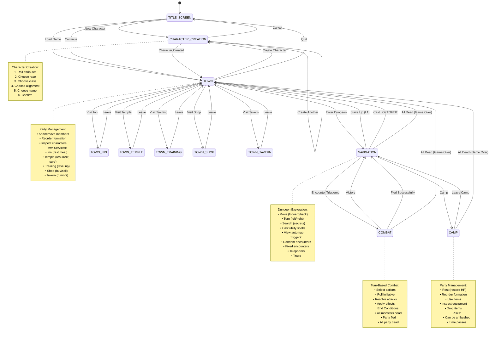

# Game State Machine Diagram

**Visual representation of modal state transitions.**

## Description

The game uses explicit modal states to control available actions and UI:

- **TOWN**: Access services (inn, temple, training), manage party
- **NAVIGATION**: Explore dungeon, move party, search for secrets
- **COMBAT**: Fight monsters, cast spells, flee
- **CHARACTER_CREATION**: Create new characters
- **CAMP**: Rest, reorder formation, use items

Only valid transitions are allowed, preventing invalid game states.

## State Transition Diagram



## State Details

### TITLE_SCREEN

**Available Actions**:
- New Game (create party)
- Load Game (restore saved game)
- Continue (last autosave)
- Options (settings)
- Quit

**Transitions**:
- → CHARACTER_CREATION (new character)
- → TOWN (load/continue)

### CHARACTER_CREATION

**Process**:
1. Roll attributes (STR, INT, PIE, VIT, AGI, LUC)
2. Allocate bonus points (7-29 points)
3. Select race (Human, Elf, Dwarf, Gnome, Hobbit)
4. Select class (based on stats)
5. Select alignment (Good, Neutral, Evil)
6. Enter name
7. Confirm creation

**Transitions**:
- → TOWN (character created, added to roster)
- → CHARACTER_CREATION (create another)
- → TITLE_SCREEN (cancel)

### TOWN

**Available Actions**:
- Enter dungeon (→ NAVIGATION)
- Visit inn (→ TOWN_INN)
- Visit temple (→ TOWN_TEMPLE)
- Visit training grounds (→ TOWN_TRAINING)
- Visit shop (→ TOWN_SHOP)
- Visit tavern (→ TOWN_TAVERN)
- Inspect characters
- Add/remove party members
- Reorder formation
- Create character (→ CHARACTER_CREATION)
- Save game
- Quit (→ TITLE_SCREEN)

**Transitions**:
- → NAVIGATION (enter dungeon stairs)
- → TOWN_* (visit service)
- → CHARACTER_CREATION (create character)
- → TITLE_SCREEN (quit)

### TOWN Services

#### TOWN_INN
- Rest (restore HP, spell points, remove fatigue)
- Costs gold (~1 gp per character)
- Characters age slightly (~0.1 years)
- VIM decreases slightly (~0.05)
- → TOWN (leave)

#### TOWN_TEMPLE
- Cure poison (cost based on level)
- Cure paralysis (cost based on level)
- Cure stone (cost based on level)
- Resurrect dead (100 × level gold, ~90% success)
- Resurrect ashes (500 × level gold, ~50% success)
- → TOWN (leave)

#### TOWN_TRAINING
- Level up (if XP sufficient)
- Costs 1000 × new_level gold
- Roll HP gain, stat changes, spell learning
- → TOWN (leave)

#### TOWN_SHOP
- Buy equipment
- Sell equipment
- Identify items
- → TOWN (leave)

#### TOWN_TAVERN
- Hear rumors
- Recruit special characters (future feature)
- → TOWN (leave)

### NAVIGATION

**Available Actions**:
- Move forward
- Move backward
- Turn left (90°)
- Turn right (90°)
- Strafe left
- Strafe right
- Search (detect secrets)
- Inspect (examine tile)
- Camp (→ CAMP)
- Cast utility spell (DUMAPIC, MILWA, MALOR, etc.)
- View automap
- View party stats

**Transitions**:
- → COMBAT (random encounter, fixed encounter)
- → CAMP (player camps)
- → TOWN (stairs up from L1, LOKTOFEIT success)
- → TOWN (all party dead - game over)

**Triggers**:
- Random encounters (chance per tile)
- Fixed encounters (scripted battles)
- Teleporters (instant movement)
- Traps (damage, status effects)
- Darkness zones (need MILWA)
- Anti-magic zones (no spells)

### CAMP

**Available Actions**:
- Rest (restore HP, not spell points)
- Reorder formation (swap front/back)
- Use items (potions, scrolls)
- Inspect equipment
- Drop items
- Leave camp (→ NAVIGATION)

**Risks**:
- Random chance of ambush (→ COMBAT)
- Time passes (aging, hunger)
- No spell point restoration (need inn)

**Transitions**:
- → NAVIGATION (leave camp)
- → COMBAT (ambushed while camping)
- → TOWN (all party dead - game over)

### COMBAT

**Turn Phases**:
1. **Input**: Select action for each character
2. **Initiative**: Roll initiative for all combatants
3. **Resolution**: Execute actions in order

**Available Actions** (Per Character):
- Fight (melee attack)
- Parry (defensive stance)
- Cast spell
- Use item
- Run (flee - whole party action)

**Transitions**:
- → NAVIGATION (victory - all monsters dead)
- → NAVIGATION (fled successfully)
- → TOWN (all party dead - game over)

**End Conditions**:
- Victory: All monster groups eliminated
- Defeat: All party members dead/incapacitated
- Flee: Party successfully runs away

## Valid State Transitions

### Transition Matrix

| From | To | Condition |
|------|-----|-----------|
| TITLE_SCREEN | CHARACTER_CREATION | New character |
| TITLE_SCREEN | TOWN | Load/continue |
| CHARACTER_CREATION | TOWN | Character created |
| CHARACTER_CREATION | TITLE_SCREEN | Cancel |
| TOWN | NAVIGATION | Enter dungeon |
| TOWN | TOWN_* | Visit service |
| TOWN | CHARACTER_CREATION | Create character |
| TOWN | TITLE_SCREEN | Quit |
| TOWN_* | TOWN | Leave service |
| NAVIGATION | COMBAT | Encounter |
| NAVIGATION | CAMP | Camp |
| NAVIGATION | TOWN | Exit dungeon |
| CAMP | NAVIGATION | Leave camp |
| CAMP | COMBAT | Ambushed |
| COMBAT | NAVIGATION | Victory/fled |
| * | TOWN | All party dead |

### Invalid Transitions

**Never Allowed**:
- COMBAT → CAMP (can't camp during combat)
- NAVIGATION → TITLE_SCREEN (must return to town first)
- TOWN_* → NAVIGATION (must return to town first)
- COMBAT → TOWN (except on total party death)

## State-Specific UI

### TOWN UI
- Party roster panel (left)
- Character stats panel (right)
- Service menu (center)
- Gold display (top)

### NAVIGATION UI
- First-person dungeon view (center)
- Party stats panel (top)
- Automap (bottom-left, if DUMAPIC cast)
- Message log (bottom)

### COMBAT UI
- Monster groups display (top)
- Party formation (left)
- Action menu (center)
- Initiative order (right)
- Message log (bottom)

### CAMP UI
- Party formation (center)
- Character details (right)
- Camp menu (left)
- Warning: "You may be ambushed!"

## State Persistence

**Saved on State Change**:
- Auto-save on TOWN entry
- Manual save in TOWN only
- Event log saved continuously

**Restored on Load**:
- Last state restored
- Event log replayed if needed
- Validation checks prevent invalid states

## Implementation Pattern

```typescript
type GameMode =
  | 'TITLE_SCREEN'
  | 'CHARACTER_CREATION'
  | 'TOWN'
  | 'TOWN_INN'
  | 'TOWN_TEMPLE'
  | 'TOWN_TRAINING'
  | 'TOWN_SHOP'
  | 'TOWN_TAVERN'
  | 'NAVIGATION'
  | 'CAMP'
  | 'COMBAT'

interface GameState {
  mode: GameMode
  // ... other state
}

function canTransition(from: GameMode, to: GameMode): boolean {
  // Validate transition is allowed
  return VALID_TRANSITIONS[from].includes(to)
}

function transitionTo(state: GameState, newMode: GameMode): GameState {
  if (!canTransition(state.mode, newMode)) {
    throw new Error(`Invalid transition: ${state.mode} → ${newMode}`)
  }

  return {
    ...state,
    mode: newMode,
    // ... update other state as needed
  }
}
```

## Key Design Benefits

1. **Clear State Boundaries**: Each mode has distinct actions/UI
2. **Invalid Action Prevention**: Can't move during combat, etc.
3. **Simplified Testing**: Test each mode independently
4. **Explicit Transitions**: All state changes tracked
5. **Save/Load Safety**: Only valid states can be saved/restored
