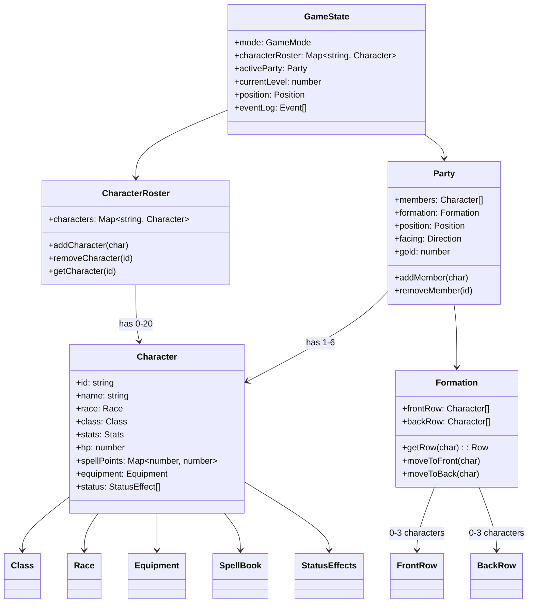

# Party Structure Diagram

**Visual representation of party and character relationships.**

## Description

The party is the core game entity. Characters belong to the roster, with 1-6 active in the party at any time.

## Diagram

## Key Relationships

**GameState → CharacterRoster**: All created characters (1:N)
**GameState → Party**: Current active party (1:1)
**Party → Character**: 1-6 active characters
**Party → Formation**: Front row (3 max) + Back row (3 max)

## Formation Rules

**Front Row**:
- Max 3 characters
- Takes melee hits
- Can attack in melee

**Back Row**:
- Max 3 characters
- Protected from melee
- Cannot melee attack (can use ranged/magic)

**Movement**:
- Characters can move front ↔ back
- Formation changes during camp (not combat)
