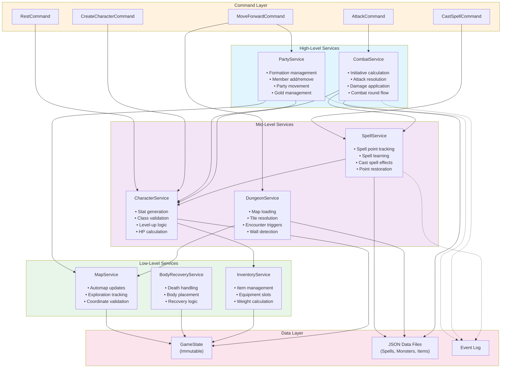

# Service Dependencies Diagram

**Visual representation of service call relationships.**

## Description

The service layer uses pure functions with clear dependency relationships:

- **No circular dependencies**: Services form a directed acyclic graph (DAG)
- **Layer separation**: Services only call other services, never commands or UI
- **Dependency injection**: Services passed as parameters where needed
- **Pure functions**: No side effects, deterministic outputs

Services are organized by domain responsibility, with higher-level services composing lower-level ones.

## Service Dependency Graph



## Service Responsibilities

### High-Level Services

**PartyService**:
- Manage party formation (front row / back row)
- Add/remove party members
- Move party through dungeon
- Manage shared party resources (gold)
- Dependencies: CharacterService, MapService

**CombatService**:
- Calculate initiative for all combatants
- Resolve attacks (hit chance, damage)
- Apply combat effects (damage, status)
- Manage combat round flow
- Dependencies: CharacterService, SpellService

### Mid-Level Services

**SpellService**:
- Track spell points (separate pools per level)
- Handle spell learning on level-up
- Execute spell effects
- Restore points on rest
- Dependencies: CharacterService, DataFiles (spells.json)

**CharacterService**:
- Generate character stats (rolls)
- Validate class/race combinations
- Handle level-up (HP, stats, spell learning)
- Calculate derived stats (AC, hit bonus)
- Dependencies: InventoryService

**DungeonService**:
- Load dungeon maps from data files
- Resolve tile properties (walls, doors, etc.)
- Trigger random encounters
- Detect special tiles (teleporters, darkness)
- Dependencies: MapService, DataFiles (maps.json, monsters.json)

### Low-Level Services

**MapService**:
- Update automap with explored tiles
- Track exploration state
- Validate coordinates
- No dependencies on other services

**BodyRecoveryService**:
- Handle character death
- Place body at death location
- Enable body recovery by other parties
- No dependencies on other services

**InventoryService**:
- Manage character equipment slots
- Handle item weight/carrying capacity
- Validate equipment restrictions (class/race)
- No dependencies on other services

## Dependency Rules

### No Circular Dependencies

```
✅ ALLOWED:
  CombatService → SpellService
  SpellService → CharacterService

❌ FORBIDDEN:
  CharacterService → CombatService (would create cycle)
```

### One-Way Data Flow

```
Commands → Services → Data Layer

Services never call Commands
Services never call UI
```

### Pure Function Pattern

All services use pure functions:
```typescript
// Example: PartyService
export function addMemberToParty(
  party: Party,
  character: Character
): Party {
  // No mutations, return new state
  return {
    ...party,
    members: [...party.members, character]
  }
}
```

### Dependency Injection

Services don't import each other directly:
```typescript
// ✅ GOOD: Pass dependencies as parameters
export function levelUpCharacter(
  character: Character,
  inventorySvc: InventoryService
): Character {
  // Use injected service
  const updatedEquipment = inventorySvc.recalculate(character.equipment)
  // ...
}

// ❌ BAD: Import service directly
import { InventoryService } from './inventory'
```

## Call Flow Examples

### Example 1: Move Forward Command

```
User Input → MoveForwardCommand
  ↓
  → PartyService.moveForward(state, direction)
    ↓
    → DungeonService.getTileAt(position)
      ↓
      → DataFiles (map.json)
    ↓
    → MapService.updateExploration(automap, position)
      ↓
      → GameState (updated)
  ↓
  → EventLog.addEvent(MoveEvent)
  ↓
  → Return new GameState
```

### Example 2: Cast Spell in Combat

```
User Input → CastSpellCommand
  ↓
  → SpellService.castSpell(caster, spell, target)
    ↓
    → SpellService.deductSpellPoints(caster, spellLevel)
      ↓
      → CharacterService.updateSpellPoints(character, level, -1)
        ↓
        → GameState (updated character)
    ↓
    → SpellService.applySpellEffect(spell, target)
      ↓
      → CombatService.applyDamage(target, damage)
        ↓
        → CharacterService.updateHP(target, newHP)
          ↓
          → GameState (updated target)
  ↓
  → EventLog.addEvent(SpellCastEvent)
  ↓
  → Return new GameState
```

### Example 3: Character Level-Up

```
Combat Victory → LevelUpCommand
  ↓
  → CharacterService.levelUp(character)
    ↓
    → CharacterService.rollHPGain(class, vitality)
    ↓
    → CharacterService.rollStatChanges(stats, age)
    ↓
    → SpellService.attemptLearnSpells(character, newLevel)
      ↓
      → SpellService.rollLearningChance(int or pie)
      ↓
      → DataFiles (spells.json)
    ↓
    → CharacterService.updateLevel(character, newStats, newHP)
      ↓
      → GameState (updated character)
  ↓
  → EventLog.addEvent(LevelUpEvent)
  ↓
  → Return new GameState
```

## Testing Strategy

### Unit Test Services in Isolation

Each service tested independently:
```typescript
test('PartyService.addMember adds character to party', () => {
  const party = createTestParty()
  const character = createTestCharacter()

  const result = PartyService.addMember(party, character)

  expect(result.members).toHaveLength(party.members.length + 1)
  expect(result.members).toContain(character)
})
```

### Integration Test Service Chains

Test multiple services together:
```typescript
test('CombatService + SpellService: Casting spell reduces points', () => {
  const state = createGameState()
  const caster = state.party.members[0]
  const spell = getSpellByName('HALITO')

  const newState = SpellService.castSpell(state, caster, spell, target)

  expect(newState.roster.get(caster.id).spellPoints.get(1)).toBe(
    caster.spellPoints.get(1) - 1
  )
})
```

## Key Design Principles

1. **Pure Functions**: No side effects, easier testing
2. **Immutable State**: Return new state, never mutate
3. **Dependency Injection**: Pass dependencies as parameters
4. **Single Responsibility**: Each service handles one domain
5. **DAG Structure**: No circular dependencies
6. **Layer Respect**: Services never call commands or UI
