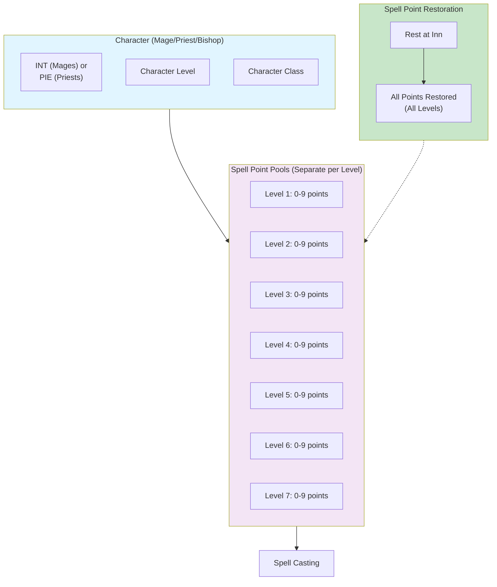
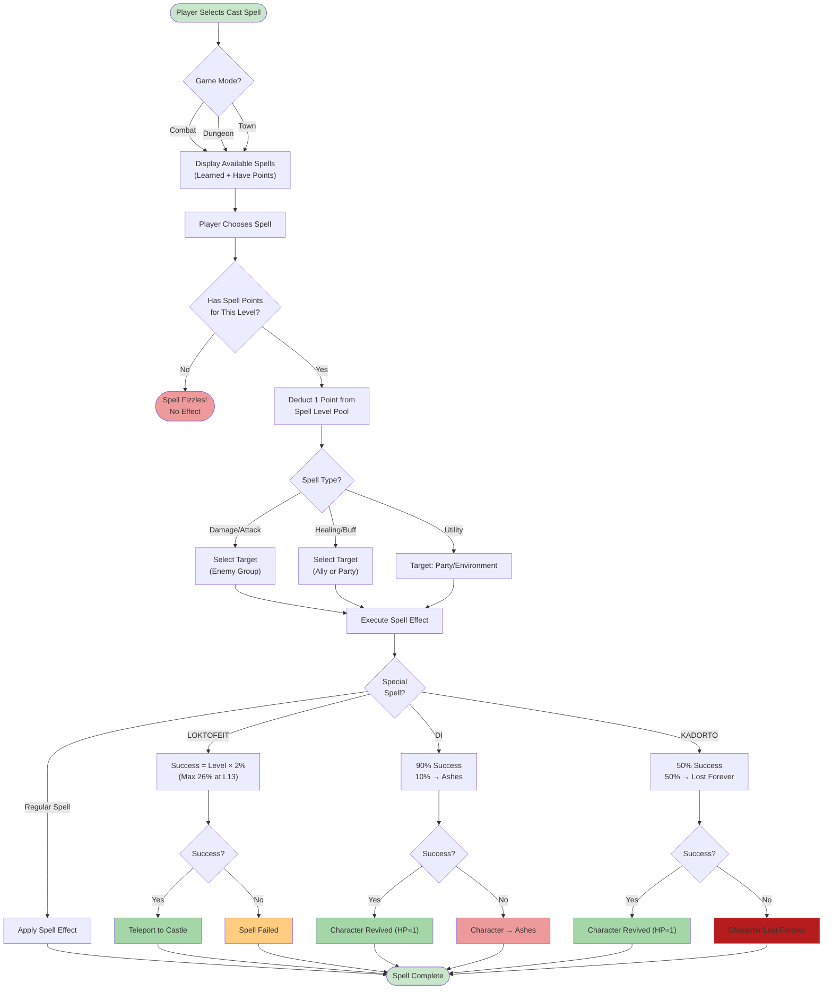
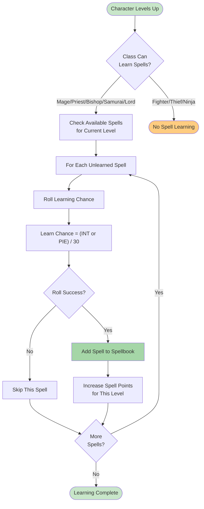

# Spell System Diagram

**Visual representation of spell points and casting flow.**

## Description

Wizardry 1 uses a spell point system (not memorized slots like D&D):

- **Separate pools** for each spell level (1-7)
- **Mage spells**: 7 levels (powered by INT)
- **Priest spells**: 7 levels (powered by PIE)
- **Each spell costs 1 point** from its level pool
- **Spell learning**: Chance = (INT or PIE) / 30 on level-up

Characters restore all spell points when resting at the inn.

## Spell Point System Diagram



## Spell Casting Flow Diagram



## Spell Learning Flow



## Spell Point Formulas

### Maximum Points Per Level
```
Points for spell level X = max(
  1 (if learned any spell this level),
  varies by class progression,
  cap at 9 maximum per level
)
```

**Notes**:
- Bishops learn spells slower (penalty applied)
- High INT/PIE characters get more points
- Formula complex; varies by when first spell learned

### Learning Probability

| INT/PIE | Learn Chance | Expected Levels to Learn |
|---------|--------------|-------------------------|
| 11 | 36.7% | ~3 levels |
| 12 | 40.0% | ~2.5 levels |
| 13 | 43.3% | ~2.3 levels |
| 14 | 46.7% | ~2.1 levels |
| 15 | 50.0% | ~2 levels |
| 16 | 53.3% | ~1.9 levels |
| 17 | 56.7% | ~1.8 levels |
| 18+ | 60.0% | ~1.7 levels |

## Spell Types by Category

### Mage Spell Categories

**Damage Spells**:
- Level 1: HALITO (1d8 fire)
- Level 2: MELITO (1d8 each)
- Level 3: MAHALITO (4d6 fire), MOLITO (3d6 each)
- Level 4: DALTO (6d6 cold), LAHALITO (6d6 fire)
- Level 5: MADALTO (party-wide), LAKANITO (vacuum)
- Level 6-7: TILTOWAIT (massive damage, all groups)

**Control Spells**:
- Level 1: KATINO (sleep)
- Level 2: DILTO (blind)
- Level 4: MORLIS (paralyze)
- Level 6-7: HAMAN/MAHAMAN (transform)

**Utility Spells**:
- Level 1: DUMAPIC (coordinates), MOGREF (-2 AC)
- Level 2: SOPIC (invisibility)
- Level 5: ZILWAN (dispel)
- Level 6: MALOR (teleport), LOMILWA (light)

### Priest Spell Categories

**Healing Spells**:
- Level 1: DIOS (1d8 HP)
- Level 3: DIAL (2d8 HP)
- Level 5: DIAL (full HP)
- Level 7: DI (resurrect from death)
- Level 5: KADORTO (resurrect from ashes)

**Defensive Spells**:
- Level 1: KALKI (-1 AC party), PORFIC (-4 AC single)
- Level 2: MATU (-2 AC party)
- Level 3: BAMATU (-4 AC party)
- Level 4: MAPORFIC (-4 AC party), KATU (massive AC party)

**Offensive Spells**:
- Level 1: BADIOS (1d8 vs undead)
- Level 3: BADIAL (2d8 all enemies)
- Level 4: BADIALMA (4d8 all undead), BAMORDI (3d8 single)
- Level 5: BADI (instant death), MABADI (death all)
- Level 6: LORTO (massive damage), MALIKTO (petrify)
- Level 7: MABADI (extinction all)

**Utility Spells**:
- Level 1: MILWA (light)
- Level 2: CALFO (identify trap), MANIFO (silence)
- Level 3: LATUMAPIC (identify foe), LOMILWA (more light)
- Level 4: KANDI (locate person), LATUMOFIS (identify enemy)
- Level 5: LOKTOFEIT (recall to castle)

## Key Points

1. **Separate Pools**: Each spell level has its own point pool (0-9 max)
2. **Fixed Cost**: All spells cost 1 point from their level pool
3. **No Fizzle**: Most spells cast successfully (exceptions: LOKTOFEIT, DI, KADORTO)
4. **Learning**: Random chance on level-up based on INT/PIE
5. **Restoration**: Only full rest at inn restores all points
6. **Multi-Class**: Bishops learn both mage and priest spells (slower rate)
