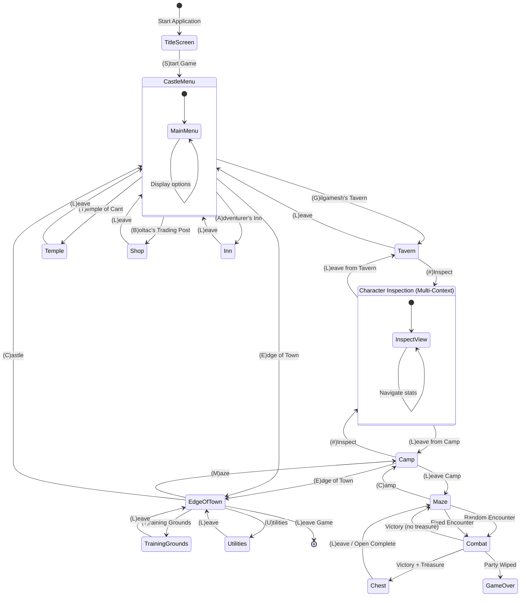

# UI Documentation Implementation Plan

> **For Claude:** REQUIRED SUB-SKILL: Use superpowers:executing-plans to implement this plan task-by-task.

**Goal:** Document all 14 user interface scenes with ASCII mockups, Mermaid diagrams, navigation flows, and complete specifications.

**Architecture:** Scene-based documentation approach (Option A) with individual files per scene, reusable pattern documentation, and comprehensive navigation mapping.

**Tech Stack:** Markdown, Mermaid diagrams, ASCII art layouts

---

## Plan Overview

This plan creates comprehensive UI documentation following the scene-based approach (Option A) as outlined in `ui-documentation-proposal.md`. We'll document all 14 scenes with ASCII mockups, create navigation diagrams, and establish UI patterns.

**Total Deliverables:**
- 14 scene documentation files
- 1 UI overview/README
- 1 navigation map with Mermaid diagrams
- 1 UI patterns guide
- 1 state management specification
- 1 input reference guide

**Implementation Phases:**
1. Setup & Foundation (Tasks 1-3)
2. Example Scenes (Tasks 4-6)
3. Town Services (Tasks 7-12)
4. Dungeon & Combat (Tasks 13-16)
5. Supporting Documentation (Tasks 17-20)
6. Final Integration (Tasks 21-22)

---

## Task 1: Create UI Documentation Directory Structure

**Goal:** Establish the `/docs/ui/` directory structure

**Files:**
- Create: `/docs/ui/README.md` (placeholder)
- Create: `/docs/ui/scenes/` (directory)

**Step 1: Create directory structure**

```bash
mkdir -p docs/ui/scenes
```

**Step 2: Create placeholder README**

Create `/docs/ui/README.md`:

```markdown
# User Interface Documentation

**Complete UI flow documentation for Wizardry 1.**

## Overview

This documentation covers all 14 user interface scenes, navigation flows, UI patterns, and state management.

**Status:** 🚧 In Progress

## Contents

- [Scenes](./scenes/) - Individual scene documentation
- [Navigation Map](./navigation-map.md) - Complete navigation flow diagram
- [UI Patterns](./ui-patterns.md) - Reusable UI conventions
- [State Management](./state-management.md) - Application state specification
- [Input Reference](./input-reference.md) - Keyboard shortcuts and input handling

## Scene List

### Safe Zone Scenes
- [Title Screen](./scenes/00-title-screen.md)
- [Castle Menu](./scenes/01-castle-menu.md) (Central Hub)
- [Training Grounds](./scenes/02-training-grounds.md)
- [Gilgamesh's Tavern](./scenes/03-gilgameshs-tavern.md)
- [Boltac's Trading Post](./scenes/04-boltacs-trading-post.md)
- [Temple of Cant](./scenes/05-temple-of-cant.md)
- [Adventurer's Inn](./scenes/06-adventurers-inn.md)
- [Edge of Town](./scenes/07-edge-of-town.md)
- [Utilities Menu](./scenes/08-utilities-menu.md)

### Dungeon Zone Scenes
- [Camp](./scenes/09-camp.md)
- [Maze](./scenes/10-maze.md)
- [Combat](./scenes/11-combat.md)
- [Chest](./scenes/12-chest.md)

### Multi-Context Scenes
- [Character Inspection](./scenes/13-character-inspection.md)

## Quick Navigation

**Starting the Game:**
Title Screen → Castle Menu

**Character Creation:**
Castle Menu → Edge of Town → Training Grounds

**Party Formation:**
Castle Menu → Gilgamesh's Tavern

**Entering Dungeon:**
Castle Menu → Edge of Town → Camp → Maze

## Architecture

- **Hub-and-Spoke Model:** Castle Menu is central hub
- **Single-Keystroke Interface:** First letter navigation (no Enter needed)
- **Context-Sensitive:** Some screens adapt based on location
- **State-Based Navigation:** Transitions validated by game state
```

**Step 3: Commit**

```bash
git add docs/ui/
git commit -m "docs: create UI documentation structure"
```

---

## Task 2: Create Scene Documentation Template

**Goal:** Create reusable template for documenting scenes

**Files:**
- Create: `/docs/ui/scene-template.md`

**Step 1: Create template file**

Create `/docs/ui/scene-template.md`:

```markdown
# [Scene Name]

## Overview

**Description:** [What is this scene? What is its purpose?]

**Scene Type:** [Safe Zone / Dungeon Zone / Multi-Context]

**Location in Game Flow:** [Where does this fit in the overall structure?]

---

## Entry Conditions

### From Where

**Parent Scene(s):**
- [Parent Scene] → (Key) → This Scene

**Example:**
- Castle Menu → (G) → Gilgamesh's Tavern

### Requirements

**State Requirements:**
- [ ] [Requirement 1]
- [ ] [Requirement 2]

**Example:**
- [ ] Must have at least one character created
- [ ] Party must not be "IN MAZE" status

### State Prerequisites

```typescript
interface EntryState {
  // Define required state for entry
}
```

---

## UI Layout

### Screen Regions

- **Header:** [Title, context info]
- **Main:** [Primary content area]
- **Menu:** [Available actions]
- **Status:** [Party/character status]
- **Messages:** [Feedback, errors]

### ASCII Mockup

```
┌─────────────────────────────────────┐
│  [SCENE TITLE]                     │
├─────────────────────────────────────┤
│                                     │
│  [Main Content Area]                │
│                                     │
│                                     │
│                                     │
├─────────────────────────────────────┤
│  (X)Action 1                        │
│  (Y)Action 2                        │
│  (L)eave                            │
└─────────────────────────────────────┘
```

---

## Available Actions

### (X) [Action Name]

**Description:** [What does this action do?]

**Key Binding:** [Single keystroke]

**Requirements:**
- [Requirement 1]
- [Requirement 2]

**Flow:**
1. [Step 1]
2. [Step 2]
3. [Step 3]

**Validation:**

```typescript
function canPerformAction(state: GameState): { allowed: boolean; reason?: string } {
  // Validation logic
}
```

**State Changes:**
- `state.property = newValue`

**UI Feedback:**
- Success: "[Success message]"
- Failure: "[Error message]"

**Transitions:**
- → [Destination Scene] (if applicable)

---

## Navigation

### Exits

| Action | Key | Destination | Condition |
|--------|-----|-------------|-----------|
| [Action] | (X) | [Scene] | [When available] |
| Leave | (L) | [Parent Scene] | Always |

### Parent Scene

- [Parent Scene] → (Key) → This Scene

### Child Scenes

- This Scene → (Key) → [Child Scene]

---

## State Management

### Scene State

```typescript
interface SceneState {
  // Local scene state
  mode: 'MODE_1' | 'MODE_2'
  selectedIndex: number | null
}
```

### Global State Changes

- [What global state does this scene modify?]

### Persistence

- **Auto-save:** [When does auto-save trigger?]
- **Manual save:** [Is manual save available?]

---

## Implementation Notes

### Services Used

- `ServiceName.methodName()`
- `AnotherService.anotherMethod()`

### Commands

- `CommandName` - [What it does]
- `AnotherCommand` - [What it does]

### Edge Cases

1. **[Edge Case 1]:** [How to handle]
2. **[Edge Case 2]:** [How to handle]

### Technical Considerations

- [Technical note 1]
- [Technical note 2]

---

## Related Documentation

- [Link to related scene]
- [Link to related system]
- [Link to related command]
```

**Step 2: Commit**

```bash
git add docs/ui/scene-template.md
git commit -m "docs: add scene documentation template"
```

---

## Task 3: Create Navigation Map Foundation

**Goal:** Create navigation map document with initial Mermaid diagram

**Files:**
- Create: `/docs/ui/navigation-map.md`

**Step 1: Create navigation map with complete state diagram**

Create `/docs/ui/navigation-map.md`:

```markdown
# UI Navigation Map

**Complete navigation flow for all 14 scenes.**

---

## Overview

Wizardry 1 uses a **hub-and-spoke navigation model** with Castle Menu as the central hub. All town services are accessed through the Castle, while dungeon access goes through Edge of Town.

**Navigation Principles:**
- **Single-keystroke navigation:** Press first letter of action (no Enter needed)
- **Case-insensitive:** 'G' and 'g' both work
- **Invalid keys:** Beep or error message
- **Context-sensitive:** Some keys mean different things in different scenes

---

## Complete Navigation Diagram



---

## Scene Categories

### Safe Zone (Auto-save on entry)
- Title Screen
- Castle Menu (central hub)
- Training Grounds
- Gilgamesh's Tavern
- Boltac's Trading Post
- Temple of Cant
- Adventurer's Inn
- Edge of Town
- Utilities Menu

### Dungeon Zone (No auto-save)
- Camp (pre-dungeon staging)
- Maze (exploration)
- Combat (battles)
- Chest (treasure)

### Multi-Context
- Character Inspection (adapts based on parent scene)

---

## Navigation Patterns

### Hub Navigation (from Castle Menu)

```
Castle Menu (Central Hub)
├─ (G) → Gilgamesh's Tavern → (L) → Castle Menu
├─ (T) → Temple of Cant → (L) → Castle Menu
├─ (B) → Boltac's Trading Post → (L) → Castle Menu
├─ (A) → Adventurer's Inn → (L) → Castle Menu
└─ (E) → Edge of Town → (C) → Castle Menu
```

### Dungeon Entry Flow

```
Castle Menu
  → (E) Edge of Town
    → (M) Camp
      → (L) Maze
        → Random/Fixed Encounter → Combat
          → Victory → Chest (optional)
            → Maze
        → (C) Camp
```

### Character Inspection (Context-Aware)

```
From Tavern:
  Tavern → (#) → Inspection → (L) → Tavern

From Camp:
  Camp → (#) → Inspection → (L) → Camp
```

---

## State-Based Navigation Rules

### Castle Menu Access

**Requirements:**
- Party NOT in maze
- Auto-saves on entry

**Restrictions:**
- Cannot access if party is IN_MAZE status
- Must return to Edge of Town first via LOKTOFEIT spell or death

### Dungeon Entry

**Requirements:**
- Party formed (1-6 characters)
- All party members OK or wounded (not dead/ashes/lost)
- Party NOT already in maze

**Restrictions:**
- Cannot enter with dead party members
- Cannot re-enter if already IN_MAZE

### Town Services

**Requirements vary by service:**
- **Temple:** Need dead/ashes/afflicted characters to heal
- **Shop:** Need gold to buy
- **Inn:** Need characters to level up or rest
- **Training Grounds:** No restrictions (can always create)

---

## Navigation Keys Reference

### Universal Keys (available in most scenes)

| Key | Action | Context |
|-----|--------|---------|
| (L) | Leave | Returns to parent scene |
| (#) | Inspect Character | Available in Tavern, Camp |
| (?) | Help | Context-sensitive help (if implemented) |

### Castle Menu Keys

| Key | Action | Destination |
|-----|--------|-------------|
| (G) | Gilgamesh's Tavern | Party formation |
| (T) | Temple of Cant | Healing/resurrection |
| (B) | Boltac's Trading Post | Buy/sell items |
| (A) | Adventurer's Inn | Rest/level up |
| (E) | Edge of Town | Gateway to dungeon |

### Edge of Town Keys

| Key | Action | Destination |
|-----|--------|-------------|
| (C) | Castle | Return to Castle Menu |
| (T) | Training Grounds | Create characters |
| (M) | Maze | Enter dungeon (via Camp) |
| (U) | Utilities | System functions |
| (L) | Leave Game | Exit application |

### Maze Keys

| Key | Action | Effect |
|-----|--------|--------|
| (W) | Forward | Move forward one tile |
| (A) | Strafe Left | Move left without turning |
| (S) | Backward | Move backward one tile |
| (D) | Strafe Right | Move right without turning |
| (Q) | Turn Left | Rotate 90° left |
| (E) | Turn Right | Rotate 90° right |
| (C) | Camp | Return to Camp scene |
| (K) | Kick Door | Force open door ahead |
| (I) | Inspect | Inspect current tile |

---

## Error Handling

### Invalid Navigation Attempts

**Scenario:** User tries to enter dungeon with dead party member

**Response:**
```
YOU CANNOT ENTER THE DUNGEON WITH DEAD PARTY MEMBERS.
VISIT THE TEMPLE FIRST.
```

**Scenario:** User tries to access Castle Menu while IN_MAZE

**Response:**
```
YOUR PARTY IS IN THE MAZE.
YOU MUST RETURN TO TOWN FIRST.
```

**Scenario:** User presses invalid key in menu

**Response:**
```
[BEEP]
INVALID SELECTION
```

---

## Implementation Notes

### Navigation Service

```typescript
interface NavigationService {
  canNavigateTo(from: SceneType, to: SceneType, state: GameState): NavigationResult
  navigate(from: SceneType, to: SceneType, state: GameState): GameState
  getAvailableActions(scene: SceneType, state: GameState): Action[]
}

interface NavigationResult {
  allowed: boolean
  reason?: string
  warning?: string
}
```

### State Transitions

**Safe transitions (always save before):**
- Any scene → Castle Menu
- Castle Menu → Any town service
- Edge of Town → Leave Game

**Risky transitions (no save):**
- Camp → Maze
- Maze → Combat
- Combat → anywhere (depends on outcome)

### Navigation Commands

- `NavigateToSceneCommand` - Generic scene transition
- `EnterDungeonCommand` - Special validation for maze entry
- `ReturnToTownCommand` - Special handling for LOKTOFEIT or death
- `LeaveGameCommand` - Save and exit

---

## Related Documentation

- [UI Patterns](./ui-patterns.md) - Reusable menu patterns
- [State Management](./state-management.md) - State transition rules
- [Individual Scenes](./scenes/) - Detailed scene documentation
```

**Step 2: Commit**

```bash
git add docs/ui/navigation-map.md
git commit -m "docs: add UI navigation map with Mermaid diagram"
```

---

## Task 4: Document Castle Menu (Example Scene #1)

**Goal:** Create comprehensive documentation for Castle Menu (central hub)

**Files:**
- Create: `/docs/ui/scenes/01-castle-menu.md`

**Step 1: Create Castle Menu documentation**

Create `/docs/ui/scenes/01-castle-menu.md`:

```markdown
# Castle Menu

## Overview

**Description:** Central hub for all town services and dungeon access. First screen shown after starting a new game or loading a saved game.

**Scene Type:** Safe Zone (auto-saves on entry)

**Location in Game Flow:** Primary navigation hub - all town services branch from here

---

## Entry Conditions

### From Where

**Parent Scene(s):**
- Title Screen → (S)tart Game → Castle Menu
- Any Town Service → (L)eave → Castle Menu
- Edge of Town → (C)astle → Castle Menu

**On First Launch:**
- New game starts here
- Load game returns here (if not IN_MAZE)

### Requirements

**State Requirements:**
- [ ] Party must NOT be IN_MAZE status
- [ ] Valid save data (for loaded games)

**Note:** If party is IN_MAZE, game loads to Camp scene instead.

### State Prerequisites

```typescript
interface CastleMenuEntryState {
  partyInMaze: boolean  // Must be false
  gameLoaded: boolean   // True if loading save
  characters: Character[] // May be empty for new game
}
```

---

## UI Layout

### Screen Regions

- **Header:** "CASTLE" title
- **Main:** Empty area (no party display in original)
- **Menu:** Service options (G/T/B/A/E)
- **Status:** Not shown (optional in remake)
- **Messages:** Feedback for invalid selections

### ASCII Mockup

```
┌─────────────────────────────────────┐
│  CASTLE                             │
├─────────────────────────────────────┤
│                                     │
│                                     │
│                                     │
│                                     │
│                                     │
│                                     │
│                                     │
├─────────────────────────────────────┤
│  (G)ILGAMESH'S TAVERN               │
│  (T)EMPLE OF CANT                   │
│  (B)OLTAC'S TRADING POST            │
│  (A)DVENTURER'S INN                 │
│  (E)DGE OF TOWN                     │
└─────────────────────────────────────┘
```

**Visual Notes:**
- Minimal design (very clean)
- No party roster shown (unlike Tavern/Camp)
- Menu-only interface
- Single-keystroke selection (no Enter needed)

---

## Available Actions

### (G) Gilgamesh's Tavern

**Description:** Form and manage party roster

**Key Binding:** G (case-insensitive)

**Requirements:**
- None (always available)

**Flow:**
1. User presses 'G'
2. Validate key (always succeeds)
3. Transition to Tavern scene

**Validation:**

```typescript
function canEnterTavern(state: GameState): { allowed: boolean; reason?: string } {
  return { allowed: true }
}
```

**State Changes:**
- `state.currentScene = SceneType.TAVERN`
- Auto-save before transition

**UI Feedback:**
- No feedback message (instant transition)

**Transitions:**
- → Gilgamesh's Tavern

---

### (T) Temple of Cant

**Description:** Heal wounds, cure ailments, resurrect dead

**Key Binding:** T (case-insensitive)

**Requirements:**
- None (always available)

**Flow:**
1. User presses 'T'
2. Validate key (always succeeds)
3. Transition to Temple scene

**Validation:**

```typescript
function canEnterTemple(state: GameState): { allowed: boolean; reason?: string } {
  return { allowed: true }
}
```

**State Changes:**
- `state.currentScene = SceneType.TEMPLE`
- Auto-save before transition

**UI Feedback:**
- No feedback message (instant transition)

**Transitions:**
- → Temple of Cant

---

### (B) Boltac's Trading Post

**Description:** Buy and sell equipment

**Key Binding:** B (case-insensitive)

**Requirements:**
- None (always available)

**Flow:**
1. User presses 'B'
2. Validate key (always succeeds)
3. Transition to Shop scene

**Validation:**

```typescript
function canEnterShop(state: GameState): { allowed: boolean; reason?: string } {
  return { allowed: true }
}
```

**State Changes:**
- `state.currentScene = SceneType.SHOP`
- Auto-save before transition

**UI Feedback:**
- No feedback message (instant transition)

**Transitions:**
- → Boltac's Trading Post

---

### (A) Adventurer's Inn

**Description:** Rest to restore spell points and level up characters

**Key Binding:** A (case-insensitive)

**Requirements:**
- None (always available)

**Flow:**
1. User presses 'A'
2. Validate key (always succeeds)
3. Transition to Inn scene

**Validation:**

```typescript
function canEnterInn(state: GameState): { allowed: boolean; reason?: string } {
  return { allowed: true }
}
```

**State Changes:**
- `state.currentScene = SceneType.INN`
- Auto-save before transition

**UI Feedback:**
- No feedback message (instant transition)

**Transitions:**
- → Adventurer's Inn

---

### (E) Edge of Town

**Description:** Gateway to Training Grounds, dungeon, and system utilities

**Key Binding:** E (case-insensitive)

**Requirements:**
- None (always available)

**Flow:**
1. User presses 'E'
2. Validate key (always succeeds)
3. Transition to Edge of Town scene

**Validation:**

```typescript
function canEnterEdgeOfTown(state: GameState): { allowed: boolean; reason?: string } {
  return { allowed: true }
}
```

**State Changes:**
- `state.currentScene = SceneType.EDGE_OF_TOWN`
- Auto-save before transition

**UI Feedback:**
- No feedback message (instant transition)

**Transitions:**
- → Edge of Town

---

### Invalid Key

**Description:** User presses any other key

**Behavior:**
- Beep sound (optional)
- Error message: "INVALID SELECTION"
- Remain in Castle Menu

---

## Navigation

### Exits

| Action | Key | Destination | Condition |
|--------|-----|-------------|-----------|
| Gilgamesh's Tavern | (G) | Tavern | Always |
| Temple of Cant | (T) | Temple | Always |
| Boltac's Trading Post | (B) | Shop | Always |
| Adventurer's Inn | (A) | Inn | Always |
| Edge of Town | (E) | Edge of Town | Always |

**Note:** No (L)eave option - Castle Menu has no parent scene except Title Screen (which is one-way)

### Parent Scene

- Title Screen → (S) → Castle Menu (one-way, cannot return to Title)

### Child Scenes

- Castle Menu → (G) → Tavern
- Castle Menu → (T) → Temple
- Castle Menu → (B) → Shop
- Castle Menu → (A) → Inn
- Castle Menu → (E) → Edge of Town

---

## State Management

### Scene State

```typescript
interface CastleMenuState {
  mode: 'MAIN_MENU'  // Only one mode
  lastInput: string | null
  errorMessage: string | null
}
```

**Notes:**
- Very simple state (no sub-menus)
- Only tracks last input for error handling

### Global State Changes

**On Entry:**
- `state.currentScene = SceneType.CASTLE_MENU`
- Auto-save triggered
- Clear any temporary dungeon state (if returning from Edge of Town)

**On Exit:**
- Save state before transitioning to child scene

### Persistence

- **Auto-save:** Yes, on entry to Castle Menu
- **Manual save:** No (must use Edge of Town → Leave Game)
- **Safe zone:** Yes (party not at risk)

---

## Implementation Notes

### Services Used

- `SceneNavigationService.transitionTo(SceneType.CASTLE_MENU)`
- `SaveService.autoSave(state)`
- `InputService.waitForSingleKeystroke()`

### Commands

- `NavigateToTavernCommand` - Transition to Tavern
- `NavigateToTempleCommand` - Transition to Temple
- `NavigateToShopCommand` - Transition to Shop
- `NavigateToInnCommand` - Transition to Inn
- `NavigateToEdgeOfTownCommand` - Transition to Edge of Town

### Edge Cases

1. **First time player (no characters):**
   - All options available
   - Most services will show "NO CHARACTERS" message
   - Player should go to Edge of Town → Training Grounds first

2. **Party in maze (should never happen):**
   - State validation prevents entry
   - Game should load to Camp instead

3. **Rapid key presses:**
   - Queue inputs or ignore until transition completes
   - Prevent double-navigation

### Technical Considerations

- **Single keystroke input:** No buffering, immediate response
- **Case-insensitive:** Accept both 'G' and 'g'
- **Auto-save reliability:** Must complete before transition
- **Scene transition animations:** Optional fade/transition effect

---

## Testing Scenarios

### Test 1: New Game Flow
```
1. Start new game
2. Verify Castle Menu appears
3. Verify all 5 options shown (G/T/B/A/E)
4. Verify no characters exist yet
5. Press each key to verify transitions work
```

### Test 2: Return from Services
```
1. From Castle Menu, press (G)
2. Verify Tavern loads
3. Press (L)eave in Tavern
4. Verify returns to Castle Menu
5. Repeat for (T), (B), (A), (E)
```

### Test 3: Auto-save
```
1. Load saved game to Castle Menu
2. Verify save timestamp updates
3. Navigate to Tavern
4. Verify save persists (check save file)
```

### Test 4: Invalid Input
```
1. At Castle Menu, press 'X' (invalid)
2. Verify error message appears
3. Verify remains in Castle Menu
4. Press valid key (G)
5. Verify transitions normally
```

---

## Related Documentation

- [Title Screen](./00-title-screen.md) - Parent scene (one-way)
- [Gilgamesh's Tavern](./03-gilgameshs-tavern.md) - Party formation
- [Temple of Cant](./05-temple-of-cant.md) - Healing services
- [Boltac's Trading Post](./04-boltacs-trading-post.md) - Shopping
- [Adventurer's Inn](./06-adventurers-inn.md) - Rest and level up
- [Edge of Town](./07-edge-of-town.md) - Dungeon gateway
- [Navigation Map](../navigation-map.md) - Complete navigation flow
```

**Step 2: Commit**

```bash
git add docs/ui/scenes/01-castle-menu.md
git commit -m "docs: add Castle Menu scene documentation"
```

---

## Task 5: Document Maze Scene (Example Scene #2)

**Goal:** Create documentation for Maze scene (dungeon exploration)

**Files:**
- Create: `/docs/ui/scenes/10-maze.md`

**Step 1: Create Maze scene documentation**

Create `/docs/ui/scenes/10-maze.md`:

```markdown
# Maze (Dungeon Exploration)

## Overview

**Description:** The dungeon exploration scene where the party navigates the 10-level labyrinth, searching for treasure, fighting monsters, and uncovering secrets.

**Scene Type:** Dungeon Zone (no auto-save, high risk)

**Location in Game Flow:** Core gameplay loop - entered from Camp, returns to Camp or Combat

---

## Entry Conditions

### From Where

**Parent Scene(s):**
- Camp → (L)eave Camp → Maze
- Combat → Victory → Maze
- Chest → (L)eave / Complete → Maze

**Re-entry:**
- If party is IN_MAZE status and game is loaded, starts in Camp with option to continue

### Requirements

**State Requirements:**
- [ ] Party formed (1-6 characters)
- [ ] All party members OK or wounded (not dead/ashes)
- [ ] Party not already IN_MAZE (unless re-entering)
- [ ] Entered through Camp scene

### State Prerequisites

```typescript
interface MazeEntryState {
  party: Party           // Must have 1-6 members
  partyStatus: PartyStatus // Must be OK or WOUNDED
  inMaze: boolean       // True if continuing, false if new entry
  currentLevel: number  // 1-10
  position: Position    // Current coordinates
  facing: Direction     // N, S, E, W
}
```

---

## UI Layout

### Screen Regions

- **Header:** Current level, coordinates (if DUMAPIC cast), facing
- **Main:** 3D first-person dungeon view (or wireframe)
- **Party Status:** Character names, HP, status
- **Message Log:** Recent events, combat messages
- **Command Prompt:** Available actions

### ASCII Mockup (Text-based version)

```
┌─────────────────────────────────────┐
│  MAZE LEVEL 1    N  (0,0)          │
├─────────────────────────────────────┤
│                                     │
│         [3D Dungeon View]           │
│                                     │
│    ███████████████████████         │
│    █                     █         │
│    █   You are here      █         │
│    █         ↑           █         │
│    █       (N)           █         │
│    █                     █         │
│    ███████████████████████         │
│                                     │
├─────────────────────────────────────┤
│  PARTY:                             │
│  1. Gandalf    12/15 HP  OK        │
│  2. Corak      25/30 HP  OK        │
│  3. Thief      8/10 HP   WOUNDED   │
├─────────────────────────────────────┤
│  (W)Forward  (S)Backward            │
│  (A)Strafe L (D)Strafe R            │
│  (Q)Turn L   (E)Turn R              │
│  (K)ick Door (I)nspect              │
│  (C)amp                             │
└─────────────────────────────────────┘
```

**Note:** Original game used 3D wireframe graphics. Modern remake may use:
- 3D rendered view
- Wireframe (retro style)
- Text descriptions (fully accessible)

---

## Available Actions

### (W) Move Forward

**Description:** Move party forward one tile in facing direction

**Key Binding:** W

**Requirements:**
- Tile ahead is not a wall
- No locked door blocking path

**Flow:**
1. User presses 'W'
2. Check tile ahead for walls/doors
3. If clear, move party forward
4. Check for random encounter (10% per move)
5. Check for fixed encounter
6. Update position and view

**Validation:**

```typescript
function canMoveForward(state: GameState): { allowed: boolean; reason?: string } {
  const ahead = getTileAhead(state.position, state.facing)

  if (ahead.hasWall(state.facing)) {
    return { allowed: false, reason: "A wall blocks your path" }
  }

  if (ahead.hasDoor(state.facing) && ahead.door.locked) {
    return { allowed: false, reason: "A locked door blocks your path" }
  }

  return { allowed: true }
}
```

**State Changes:**
- `state.position = newPosition`
- `state.encounterCheck = rollEncounter()`
- If encounter: `state.currentScene = SceneType.COMBAT`

**UI Feedback:**
- Success: View updates, position changes
- Failure: "A WALL BLOCKS YOUR PATH" or "A LOCKED DOOR BLOCKS YOUR PATH"

**Transitions:**
- → Combat (if encounter triggered)
- → Maze (continue exploring)

---

### (S) Move Backward

**Description:** Move party backward one tile (opposite of facing direction)

**Key Binding:** S

**Requirements:**
- Tile behind is not a wall

**Flow:**
1. User presses 'S'
2. Check tile behind for walls
3. If clear, move party backward
4. Check for random encounter (10% per move)
5. Update position and view

**Validation:**

```typescript
function canMoveBackward(state: GameState): { allowed: boolean; reason?: string } {
  const behind = getTileBehind(state.position, state.facing)

  if (behind.hasWall(getOppositeDirection(state.facing))) {
    return { allowed: false, reason: "A wall blocks your path" }
  }

  return { allowed: true }
}
```

**State Changes:**
- `state.position = newPosition`
- `state.encounterCheck = rollEncounter()`

**UI Feedback:**
- Success: View updates, position changes
- Failure: "A WALL BLOCKS YOUR PATH"

---

### (A) Strafe Left

**Description:** Move left without changing facing direction

**Key Binding:** A

**Requirements:**
- Tile to left is not a wall

**Flow:**
1. User presses 'A'
2. Check tile to left for walls
3. If clear, move party left
4. Check for random encounter
5. Update position (facing unchanged)

**Validation:**

```typescript
function canStrafeLeft(state: GameState): { allowed: boolean; reason?: string } {
  const left = getTileToLeft(state.position, state.facing)

  if (left.hasWall(getLeftDirection(state.facing))) {
    return { allowed: false, reason: "A wall blocks your path" }
  }

  return { allowed: true }
}
```

**State Changes:**
- `state.position = newPosition`
- `state.facing` unchanged

---

### (D) Strafe Right

**Description:** Move right without changing facing direction

**Key Binding:** D

**Requirements:**
- Tile to right is not a wall

**Flow:**
1. User presses 'D'
2. Check tile to right for walls
3. If clear, move party right
4. Check for random encounter
5. Update position (facing unchanged)

---

### (Q) Turn Left

**Description:** Rotate facing direction 90° counter-clockwise

**Key Binding:** Q

**Requirements:**
- None (always available)

**Flow:**
1. User presses 'Q'
2. Update facing direction
3. Update view

**State Changes:**
- `state.facing = rotateLeft(state.facing)`

**UI Feedback:**
- View rotates left instantly

---

### (E) Turn Right

**Description:** Rotate facing direction 90° clockwise

**Key Binding:** E

**Requirements:**
- None (always available)

**Flow:**
1. User presses 'E'
2. Update facing direction
3. Update view

**State Changes:**
- `state.facing = rotateRight(state.facing)`

**UI Feedback:**
- View rotates right instantly

---

### (K) Kick Door

**Description:** Attempt to force open a locked door

**Key Binding:** K

**Requirements:**
- Door exists directly ahead
- Door is locked

**Flow:**
1. User presses 'K'
2. Check for door ahead
3. If door exists and is locked:
   a. Select strongest fighter
   b. Roll STR check vs door difficulty
   c. On success: door opens
   d. On failure: possible damage to character
4. Update door state

**Validation:**

```typescript
function canKickDoor(state: GameState): { allowed: boolean; reason?: string } {
  const ahead = getTileAhead(state.position, state.facing)

  if (!ahead.hasDoor(state.facing)) {
    return { allowed: false, reason: "There is no door ahead" }
  }

  if (!ahead.door.locked) {
    return { allowed: false, reason: "The door is already open" }
  }

  return { allowed: true }
}
```

**State Changes:**
- `door.locked = false` (on success)
- `character.hp -= damage` (on failure)

**UI Feedback:**
- Success: "THE DOOR BURSTS OPEN!"
- Failure: "[Name] SLAMS INTO THE DOOR! (2 HP damage)"

---

### (I) Inspect

**Description:** Examine current tile for secret doors, traps, or details

**Key Binding:** I

**Requirements:**
- None (always available)

**Flow:**
1. User presses 'I'
2. Show detailed tile description
3. Check for hidden features (secret doors)
4. Display results

**UI Feedback:**
- "YOU ARE IN A 20' x 20' CORRIDOR."
- "EXITS: NORTH, EAST"
- "YOU NOTICE NOTHING UNUSUAL."

**Transitions:**
- Remains in Maze

---

### (C) Camp

**Description:** Return to Camp scene to rest, reorganize, or leave dungeon

**Key Binding:** C

**Requirements:**
- None (always available, emergency escape)

**Flow:**
1. User presses 'C'
2. Transition to Camp scene
3. Preserve IN_MAZE status

**State Changes:**
- `state.currentScene = SceneType.CAMP`
- `state.party.inMaze = true` (preserved)

**UI Feedback:**
- Instant transition to Camp

**Transitions:**
- → Camp

---

## Navigation

### Exits

| Action | Key | Destination | Condition |
|--------|-----|-------------|-----------|
| Camp | (C) | Camp | Always |
| Stairs Down | (D)escend | Maze (next level) | On stairs tile |
| Stairs Up | (A)scend | Maze (prev level) | On stairs tile |

**Special Exits:**
- Random/Fixed Encounter → Combat
- Victory + Treasure → Chest → Maze

### Parent Scene

- Camp → (L)eave Camp → Maze

### Child Scenes

- Maze → Combat (encounters)
- Maze → Chest (post-combat treasure)
- Maze → Camp (player choice)

---

## State Management

### Scene State

```typescript
interface MazeState {
  mode: 'EXPLORING' | 'INSPECTING' | 'IN_ENCOUNTER'
  position: Position
  facing: Direction
  currentLevel: number
  lightRadius: number  // Affected by MILWA/LOMILWA spells
  encounterSteps: number  // Track steps since last encounter
  messageLog: string[]
}
```

### Global State Changes

**On Entry:**
- `state.currentScene = SceneType.MAZE`
- `state.party.inMaze = true`
- NO auto-save (dangerous zone)

**On Movement:**
- Update position/facing
- Roll encounter check (10% per move)
- Trigger fixed encounters if on special tile

**On Exit to Camp:**
- Preserve `inMaze` status
- Allow return to Maze

### Persistence

- **Auto-save:** NO (dungeon zone is high-risk)
- **Manual save:** NO (must return to town via LOKTOFEIT or death)
- **State preservation:** Position/facing preserved when returning to Camp

---

## Encounter System

### Random Encounters

**Trigger Rate:** 10% per movement action (W/S/A/D)

**Roll:**
```typescript
function checkRandomEncounter(steps: number): boolean {
  const roll = random(1, 100)
  return roll <= 10
}
```

**Enemy Selection:**
- Based on dungeon level (1-10)
- Weighted by monster rarity
- 1-4 enemy groups

### Fixed Encounters

**Trigger:** Entering specific tile coordinates

**Behavior:**
- Guaranteed encounter on first visit
- May respawn after time (depends on monster)
- Often guards treasure or special items

**Example:**
- Level 4 @ (10,10): Werdna's Throne Room (end boss)

---

## Special Tiles

### Stairs

**Down Stairs:**
- Press (D)escend to go deeper
- Leads to next level (1→2, 2→3, etc.)
- Cannot descend past level 10

**Up Stairs:**
- Press (A)scend to go up
- Leads to previous level (2→1, 3→2, etc.)
- Level 1 stairs lead to Camp/Castle

### Chutes

**Description:** One-way teleport (usually down)

**Behavior:**
- Instantly teleport to different level/position
- Cannot avoid (triggers on entry)
- Often leads to dangerous areas

### Anti-Magic Zones

**Description:** Areas where spells fail

**Behavior:**
- MILWA/LOMILWA fail (darkness)
- Combat spells may fail
- MALOR teleport fails

### Dark Zones

**Description:** Areas where light doesn't work

**Behavior:**
- Even LOMILWA cannot illuminate
- Reduced visibility
- Higher chance of surprise encounters

---

## Implementation Notes

### Services Used

- `DungeonNavigationService.moveParty(direction)`
- `EncounterService.rollRandomEncounter(level, steps)`
- `DungeonService.getTile(level, position)`
- `LightService.calculateVisibility(lightRadius, position)`

### Commands

- `MoveForwardCommand` - Move party forward
- `MoveBackwardCommand` - Move party backward
- `StrafeLeftCommand` - Strafe left
- `StrafeRightCommand` - Strafe right
- `TurnLeftCommand` - Rotate left
- `TurnRightCommand` - Rotate right
- `KickDoorCommand` - Force door open
- `InspectTileCommand` - Examine current tile
- `ReturnToCampCommand` - Return to Camp

### Edge Cases

1. **Moving into wall:**
   - Show error message
   - Do not consume action
   - Do not roll encounter

2. **Encounter during turn/strafe:**
   - Turning does not trigger encounters
   - Only forward/backward/strafe movement triggers

3. **Chute activation:**
   - Cannot be avoided
   - May trigger mid-combat (teleports entire party)

4. **Party wipe in dungeon:**
   - Game over OR
   - Return to town (bodies in dungeon, can recover with KANDI spell)

### Technical Considerations

- **3D rendering:** Wireframe or textured (design choice)
- **Movement smoothing:** Instant vs animated transitions
- **Encounter animations:** Transition to combat scene
- **Light radius:** Affects visibility range (default 1 tile without MILWA)

---

## Testing Scenarios

### Test 1: Basic Movement
```
1. Enter Maze from Camp
2. Press (W) to move forward
3. Verify position updates
4. Press (Q) to turn left
5. Verify facing changes
6. Press (C) to return to Camp
7. Verify returns to Camp with IN_MAZE status
```

### Test 2: Wall Collision
```
1. Face a wall
2. Press (W) to move forward
3. Verify error message appears
4. Verify position unchanged
5. Verify no encounter rolled
```

### Test 3: Random Encounter
```
1. Move around dungeon (W/S/A/D)
2. Trigger random encounter (may take several moves)
3. Verify transitions to Combat scene
4. Win combat
5. Verify returns to Maze at same position
```

### Test 4: Door Interaction
```
1. Find locked door
2. Press (K) to kick
3. Verify STR check rolls
4. On success: verify door opens
5. Press (W) to move through
6. Verify movement succeeds
```

---

## Related Documentation

- [Camp](./09-camp.md) - Parent scene
- [Combat](./11-combat.md) - Encounter scene
- [Chest](./12-chest.md) - Post-combat treasure
- [Dungeon System](../../systems/dungeon-system.md) - Dungeon generation
- [Combat System](../../systems/combat-system.md) - Encounter mechanics
- [Navigation Map](../navigation-map.md) - Complete flow
```

**Step 2: Commit**

```bash
git add docs/ui/scenes/10-maze.md
git commit -m "docs: add Maze scene documentation with movement and encounters"
```

---

## Task 6: Document Combat Scene (Example Scene #3)

**Goal:** Create documentation for Combat scene (battle interface)

**Files:**
- Create: `/docs/ui/scenes/11-combat.md`

**Step 1: Create Combat scene documentation**

Create `/docs/ui/scenes/11-combat.md`:

```markdown
# Combat

## Overview

**Description:** Turn-based combat interface where the party fights monsters using physical attacks, spells, and special abilities.

**Scene Type:** Dungeon Zone (no auto-save, high risk)

**Location in Game Flow:** Triggered by random or fixed encounters in the Maze

---

## Entry Conditions

### From Where

**Parent Scene(s):**
- Maze → Random Encounter → Combat
- Maze → Fixed Encounter → Combat

**Trigger Types:**
- **Random:** 10% chance per movement action
- **Fixed:** Entering specific coordinates
- **Scripted:** Story encounters (e.g., Werdna boss fight)

### Requirements

**State Requirements:**
- [ ] Party in Maze
- [ ] Encounter triggered (random or fixed)
- [ ] At least one party member alive

**If all party members dead:**
- Game over or return to town (bodies remain in dungeon)

### State Prerequisites

```typescript
interface CombatEntryState {
  party: Party
  encounterType: 'RANDOM' | 'FIXED' | 'SCRIPTED'
  enemyGroups: EnemyGroup[]  // 1-4 groups
  surpriseRound: 'PARTY' | 'ENEMY' | 'NONE'
  canFlee: boolean  // False for fixed/scripted encounters
}
```

---

## UI Layout

### Screen Regions

- **Header:** Combat round number, surprise status
- **Enemy Display:** Enemy groups with names and counts
- **Party Display:** Character names, HP, status, position (front/back)
- **Action Menu:** Combat options per character
- **Message Log:** Combat results, damage, effects
- **Prompt:** Current character's turn

### ASCII Mockup

```
┌─────────────────────────────────────┐
│  COMBAT - ROUND 1                   │
├─────────────────────────────────────┤
│  ENEMIES:                           │
│  Group 1: 3 ORCS        [FIGHTING] │
│  Group 2: 1 ORC SHAMAN  [FIGHTING] │
│                                     │
├─────────────────────────────────────┤
│  YOUR PARTY:            HP    ST    │
│  1. Gandalf (FRONT)    15/15  OK   │
│  2. Corak (FRONT)      28/30  OK   │
│  3. Thief (BACK)        8/10  OK   │
│  4. Priest (BACK)      12/12  OK   │
│                                     │
├─────────────────────────────────────┤
│  Gandalf's Turn:                    │
│  (F)ight  (C)ast  (P)arry           │
│  (U)se Item  (R)un                  │
│                                     │
├─────────────────────────────────────┤
│  > Corak attacks Group 1!           │
│  > Corak hits ORC for 8 damage!     │
│  > ORC dies!                        │
└─────────────────────────────────────┘
```

---

## Combat Flow

### Round Structure

**1. Initiative Phase:**
- Determine action order (surprise > speed > random)

**2. Player Actions Phase:**
- Each party member selects action
- Actions queue until all selected

**3. Resolution Phase:**
- Resolve all actions in initiative order
- Display results
- Check for victory/defeat

**4. Enemy Actions Phase:**
- Enemy AI selects actions
- Resolve enemy attacks/spells
- Display results

**5. End of Round:**
- Check for victory/defeat/flee
- If combat continues, start new round

---

## Available Actions

### (F) Fight

**Description:** Physical melee attack against enemy group

**Key Binding:** F

**Requirements:**
- Character alive (not dead/ashes)
- At least one enemy alive

**Flow:**
1. User presses 'F'
2. Prompt: "ATTACK WHICH GROUP? (1-4)"
3. User selects target group number
4. Queue attack action
5. Resolve during Resolution Phase

**Attack Resolution:**
```typescript
function resolveAttack(attacker: Character, targetGroup: EnemyGroup): AttackResult {
  const toHit = calculateToHit(attacker.level, attacker.class, targetGroup.ac)
  const roll = rollD20()

  if (roll >= toHit) {
    const damage = rollWeaponDamage(attacker.weapon)
    const target = selectRandomEnemy(targetGroup)
    target.hp -= damage
    return { hit: true, damage, target }
  }

  return { hit: false }
}
```

**UI Feedback:**
- Hit: "[Name] hits [Enemy] for [X] damage!"
- Miss: "[Name] swings and misses!"
- Kill: "[Enemy] dies!"

---

### (C) Cast Spell

**Description:** Cast mage or priest spell in combat

**Key Binding:** C

**Requirements:**
- Character is Mage/Priest/Bishop/Lord/Samurai
- Has spell points remaining
- Has learned spells

**Flow:**
1. User presses 'C'
2. Prompt: "WHICH SPELL? (MAGE 1-7 or PRIEST 1-7)"
3. User selects spell level
4. Show available spells for that level
5. User selects spell
6. Prompt for target (if needed)
7. Queue spell action

**Spell Categories:**
- **Offensive:** HALITO, MAHALITO, LAHALITO, TILTOWAIT, etc.
- **Defensive:** MOGREF, KALKI, BAMATU, PORFIC, etc.
- **Control:** KATINO (sleep), MORLIS (paralyze), MANIFO (silence)
- **Utility:** LATUMAPIC (identify), ZILWAN (dispel)

**UI Feedback:**
- Success: "[Name] casts [Spell]! [Effect]"
- Failure: "[Spell] has no effect!"
- Resisted: "[Enemy] resists [Spell]!"

---

### (P) Parry

**Description:** Defensive stance, improves AC for this round

**Key Binding:** P

**Requirements:**
- Character alive
- Not already defending

**Flow:**
1. User presses 'P'
2. Queue parry action
3. Resolve immediately: AC -= 2 for this round

**Effect:**
- Lowers AC by 2 (better defense)
- Lasts only current round
- Cannot attack while parrying

**UI Feedback:**
- "[Name] defends!"

---

### (U) Use Item

**Description:** Use consumable item (potion, scroll, etc.)

**Key Binding:** U

**Requirements:**
- Character alive
- Has usable item in inventory

**Flow:**
1. User presses 'U'
2. Show character's inventory
3. User selects item
4. Prompt for target (if needed)
5. Queue item use action

**Usable Items:**
- Healing Potions
- Scrolls (cast spells without spell points)
- Special items (quest items with combat effects)

**UI Feedback:**
- "[Name] uses [Item]! [Effect]"

---

### (R) Run (Flee)

**Description:** Attempt to flee combat

**Key Binding:** R

**Requirements:**
- Combat is not scripted/fixed encounter
- Party not surrounded

**Flow:**
1. User presses 'R'
2. All party members attempt to flee
3. Roll flee check (based on party speed vs enemy speed)
4. On success: Return to Maze (same position)
5. On failure: Enemy gets free round of attacks

**Flee Chance:**
```typescript
function calculateFleeChance(party: Party, enemies: EnemyGroup[]): number {
  const partySpeed = getAverageSpeed(party)
  const enemySpeed = getAverageSpeed(enemies)

  const baseChance = 50
  const speedMod = (partySpeed - enemySpeed) * 5

  return clamp(baseChance + speedMod, 10, 90)
}
```

**UI Feedback:**
- Success: "THE PARTY FLEES!"
- Failure: "UNABLE TO FLEE!"

**Restrictions:**
- Cannot flee from fixed encounters (e.g., Werdna)
- Cannot flee if surrounded (4+ enemy groups)

---

### (D) Dispel Undead (Priest/Bishop/Lord only)

**Description:** Attempt to destroy or banish undead enemies

**Key Binding:** D

**Requirements:**
- Character is Priest/Bishop/Lord
- Enemy group contains undead

**Flow:**
1. User presses 'D'
2. Prompt: "DISPEL WHICH GROUP? (1-4)"
3. User selects target group
4. Roll dispel check (based on character level vs undead level)
5. On success: Undead group destroyed or flees

**Dispel Chance:**
```typescript
function calculateDispelChance(caster: Character, undeadLevel: number): number {
  const levelDiff = caster.level - undeadLevel
  const baseChance = 50 + (levelDiff * 10)

  return clamp(baseChance, 5, 95)
}
```

**UI Feedback:**
- Success: "[Name] dispels [Undead]! They flee in terror!"
- Failure: "[Name]'s prayer has no effect!"

---

## Navigation

### Exits

| Outcome | Destination | Condition |
|---------|-------------|-----------|
| Victory (no treasure) | Maze | All enemies dead |
| Victory (with treasure) | Chest | All enemies dead + treasure |
| Party Wiped | Game Over / Town | All party members dead |
| Flee Success | Maze | Flee check succeeds |

### Parent Scene

- Maze → Encounter → Combat

### Child Scenes

- Combat → Chest (if treasure)
- Combat → Maze (no treasure or flee)

---

## State Management

### Scene State

```typescript
interface CombatState {
  mode: 'SELECTING_ACTIONS' | 'RESOLVING' | 'ENEMY_TURN' | 'VICTORY' | 'DEFEAT'
  round: number
  initiative: InitiativeOrder[]
  pendingActions: Action[]
  currentCharacterIndex: number
  enemyGroups: EnemyGroup[]
  messageLog: CombatMessage[]
  canFlee: boolean
}
```

### Global State Changes

**During Combat:**
- Character HP changes
- Character status changes (poisoned, paralyzed, etc.)
- Spell point consumption
- Item consumption

**On Victory:**
- Gain XP
- Gain gold
- Possible treasure (→ Chest scene)

**On Defeat:**
- Party wipe (game over or return to town)
- Character death (dead → ashes)

### Persistence

- **Auto-save:** NO (dungeon zone)
- **State preservation:** Combat state lost on defeat (no save-scumming)

---

## Combat Mechanics

### Initiative Order

**Surprise Round:**
- If party surprises enemies: party acts first, enemies skip round
- If enemies surprise party: enemies act first, party skip round
- If no surprise: normal initiative

**Normal Initiative:**
1. Fastest to slowest (AGI-based)
2. Ties broken randomly
3. Actions resolve in initiative order

### Attack Resolution

**To-Hit Calculation:**
```typescript
function calculateToHit(attackerLevel: number, attackerClass: Class, targetAC: number): number {
  const baseToHit = 10
  const levelBonus = attackerLevel
  const classBonus = getClassAttackBonus(attackerClass)

  return baseToHit + levelBonus + classBonus - targetAC
}
```

**Critical Hits:**
- Roll 20: Automatic hit, double damage
- Roll 1: Automatic miss

**Damage Calculation:**
```typescript
function calculateDamage(weapon: Weapon, attacker: Character): number {
  const baseDamage = rollWeaponDice(weapon)
  const strBonus = getStrengthBonus(attacker.strength)

  return baseDamage + strBonus
}
```

### Spell Resistance

**Magic Resistance:**
- Some enemies have magic resistance (%)
- Roll vs resistance for each spell
- Resistance applies to offensive spells only

**Saving Throws:**
- Enemies roll saving throw vs spell level
- Success: half damage or no effect (depends on spell)

---

## Enemy AI

**Basic AI Behavior:**
1. **Weak enemies:** Attack nearest target
2. **Smart enemies:** Target weakest party member (lowest HP)
3. **Casters:** Prioritize offensive spells
4. **Undead:** May attempt to level drain

**Special Abilities:**
- Breath weapons (dragons)
- Level drain (undead)
- Paralyze (ghouls)
- Poison (giant spiders)

---

## Implementation Notes

### Services Used

- `CombatService.startCombat(party, enemies)`
- `CombatService.resolveRound(state)`
- `AttackService.calculateToHit(attacker, target)`
- `SpellService.castCombatSpell(caster, spell, targets)`
- `LootService.generateTreasure(enemies, level)`

### Commands

- `AttackCommand` - Physical attack
- `CastSpellCommand` - Cast combat spell
- `ParryCommand` - Defend
- `UseItemCommand` - Use consumable
- `FleeCommand` - Attempt to flee
- `DispellCommand` - Dispel undead (Priest only)

### Edge Cases

1. **All enemies of one group dead:**
   - Remove group from combat
   - Retarget attacks to next group

2. **Character dies during combat:**
   - Skip their turn
   - Body remains (can be resurrected later)

3. **Party flees mid-combat:**
   - Drop all treasure
   - Return to Maze at same position
   - Enemies may still be there (respawn logic)

4. **Spell fizzles (not enough SP):**
   - Show error message
   - Allow re-selection of action

### Technical Considerations

- **Action queuing:** All party actions selected before resolution
- **Initiative calculation:** Speed-based with randomization
- **Animation timing:** Smooth transitions between actions
- **Message log:** Scrolling combat log for long battles

---

## Testing Scenarios

### Test 1: Basic Combat Flow
```
1. Trigger random encounter in Maze
2. Select (F)ight for all party members
3. Target different enemy groups
4. Resolve round
5. Verify damage applied correctly
6. Continue until victory
7. Verify XP and gold awarded
```

### Test 2: Spell Casting
```
1. Enter combat
2. Select (C)ast for Mage
3. Choose HALITO (level 1 fire spell)
4. Target enemy group
5. Verify damage rolls (1d8 per enemy in group)
6. Verify spell points decrease
```

### Test 3: Fleeing
```
1. Enter combat (random encounter)
2. Select (R)un
3. Roll flee check
4. On success: verify return to Maze
5. On failure: verify enemy free attack
```

### Test 4: Character Death
```
1. Enter combat with wounded characters
2. Allow enemy to attack and kill character
3. Verify character status changes to DEAD
4. Verify dead character skips turns
5. Win combat
6. Verify dead character remains dead
7. Return to town
8. Visit Temple for resurrection
```

---

## Related Documentation

- [Maze](./10-maze.md) - Parent scene
- [Chest](./12-chest.md) - Post-combat treasure
- [Combat System](../../systems/combat-system.md) - Complete combat mechanics
- [Spell Reference](../../research/spell-reference.md) - All combat spells
- [Character Classes](../../systems/character-system.md) - Class abilities
```

**Step 2: Commit**

```bash
git add docs/ui/scenes/11-combat.md
git commit -m "docs: add Combat scene documentation with turn-based mechanics"
```

---

## Task 7: Document Remaining 11 Scenes

**Goal:** Create documentation for all remaining scenes using the established template and examples

**Files to Create:**
- `/docs/ui/scenes/00-title-screen.md`
- `/docs/ui/scenes/02-training-grounds.md`
- `/docs/ui/scenes/03-gilgameshs-tavern.md`
- `/docs/ui/scenes/04-boltacs-trading-post.md`
- `/docs/ui/scenes/05-temple-of-cant.md`
- `/docs/ui/scenes/06-adventurers-inn.md`
- `/docs/ui/scenes/07-edge-of-town.md`
- `/docs/ui/scenes/08-utilities-menu.md`
- `/docs/ui/scenes/09-camp.md`
- `/docs/ui/scenes/12-chest.md`
- `/docs/ui/scenes/13-character-inspection.md`

**Step 1: Create each scene documentation file**

For each scene:
1. Use scene template from Task 2
2. Reference research from `ui-flow-validation.md`
3. Include ASCII mockup
4. Document all actions with validation logic
5. Include navigation table
6. Document state management
7. Add implementation notes

**Step 2: Commit after completing all 11 scenes**

```bash
git add docs/ui/scenes/
git commit -m "docs: add documentation for all 11 remaining scenes"
```

**Note:** This task can be broken down further if needed. Each scene takes approximately 30-45 minutes to document thoroughly.

---

## Task 8: Create UI Patterns Guide

**Goal:** Document reusable UI patterns used across multiple scenes

**Files:**
- Create: `/docs/ui/ui-patterns.md`

**Step 1: Create UI patterns guide**

Create `/docs/ui/ui-patterns.md`:

```markdown
# UI Patterns

**Reusable interface patterns used across Wizardry 1 scenes.**

---

## Pattern Catalog

### 1. Standard Menu Pattern
### 2. Character Selection Pattern
### 3. Single-Keystroke Input Pattern
### 4. Error Handling Pattern
### 5. Confirmation Dialog Pattern
### 6. Multi-Step Transaction Pattern
### 7. List Navigation Pattern

---

## 1. Standard Menu Pattern

**Used In:** Castle Menu, Edge of Town, Tavern, Temple, Shop, Inn

**Description:** Display location title, optional state info, and menu of actions with single-letter shortcuts.

**Visual Pattern:**

```
┌─────────────────────────────────────┐
│  LOCATION NAME                      │
├─────────────────────────────────────┤
│  [Optional State Display]           │
│                                     │
├─────────────────────────────────────┤
│  (X)Action 1                        │
│  (Y)Action 2                        │
│  (L)eave                            │
└─────────────────────────────────────┘
```

**Input Handling:**
- Single keystroke (no Enter needed)
- Case-insensitive
- First letter of action
- Invalid key → error beep/message

**Implementation:**

```typescript
interface MenuPattern {
  title: string
  stateDisplay?: React.ReactNode
  actions: MenuAction[]
}

interface MenuAction {
  key: string
  label: string
  handler: () => void
  enabled: boolean
  tooltip?: string
}

function renderMenu(menu: MenuPattern): void {
  displayTitle(menu.title)
  if (menu.stateDisplay) {
    displayState(menu.stateDisplay)
  }
  displayActions(menu.actions)
  waitForKeystroke((key) => {
    const action = menu.actions.find(a => a.key.toLowerCase() === key.toLowerCase())
    if (action && action.enabled) {
      action.handler()
    } else {
      showError("INVALID SELECTION")
    }
  })
}
```

---

## 2. Character Selection Pattern

**Used In:** Tavern, Camp, Shop, Temple, Inn, Training Grounds

**Description:** Display numbered list of characters or party slots, prompt for selection by number.

**Visual Pattern:**

```
Select Character:
1. Gandalf the Mage      HP: 15/15  OK
2. Corak the Fighter     HP: 28/30  OK
3. Thief the Thief       HP:  8/10  WOUNDED
4. (empty)

Enter number (1-6):
```

**Input Handling:**
- Numeric input (1-6)
- Validate selection exists
- Validate character status (depends on context)

**Implementation:**

```typescript
interface CharacterSelectionPattern {
  characters: (Character | null)[]
  prompt: string
  validator: (character: Character | null) => ValidationResult
}

function selectCharacter(pattern: CharacterSelectionPattern): Character | null {
  displayCharacterList(pattern.characters)
  displayPrompt(pattern.prompt)

  const index = waitForNumericInput(1, pattern.characters.length)
  const character = pattern.characters[index - 1]

  const validation = pattern.validator(character)
  if (!validation.allowed) {
    showError(validation.reason)
    return null
  }

  return character
}
```

**Variants:**

**A. Party Member Selection (1-6):**
```
1. Gandalf    OK
2. Corak      OK
3. (empty)
4. (empty)
5. (empty)
6. (empty)
```

**B. All Characters Selection (1-20+):**
```
1. Gandalf    OK       IN PARTY
2. Corak      OK       IN PARTY
3. Thief      DEAD     IN TOWN
4. Legolas    OK       IN TOWN
...
```

---

## 3. Single-Keystroke Input Pattern

**Used In:** All scenes

**Description:** Accept single character input without requiring Enter key.

**Behavior:**
- Immediate response to keypress
- Case-insensitive (usually)
- No buffering (ignore rapid presses)
- Visual feedback on invalid input

**Implementation:**

```typescript
function waitForSingleKeystroke(validKeys: string[]): string {
  return new Promise((resolve) => {
    const handler = (event: KeyboardEvent) => {
      const key = event.key.toUpperCase()

      if (validKeys.includes(key)) {
        document.removeEventListener('keydown', handler)
        resolve(key)
      } else {
        playErrorBeep()
        showErrorMessage("INVALID KEY")
      }
    }

    document.addEventListener('keydown', handler)
  })
}
```

**Accessibility:**
- Support both uppercase and lowercase
- Provide visual feedback
- Allow Escape to cancel (where appropriate)

---

## 4. Error Handling Pattern

**Used In:** All scenes

**Description:** Consistent error messaging and recovery.

**Error Types:**

**A. Invalid Input:**
```
[BEEP]
INVALID SELECTION
```

**B. Precondition Failed:**
```
YOU CANNOT DO THAT NOW.
[Reason]
```

**C. Insufficient Resources:**
```
YOU DON'T HAVE ENOUGH GOLD.
Cost: 500 GP
You have: 250 GP
```

**Implementation:**

```typescript
type ErrorSeverity = 'INFO' | 'WARNING' | 'ERROR' | 'FATAL'

interface GameError {
  severity: ErrorSeverity
  message: string
  details?: string
  canRetry: boolean
}

function handleError(error: GameError): void {
  playErrorSound(error.severity)
  displayErrorMessage(error.message)

  if (error.details) {
    displayErrorDetails(error.details)
  }

  if (error.canRetry) {
    displayPrompt("Press any key to continue...")
  } else if (error.severity === 'FATAL') {
    returnToSafeScene()
  }
}
```

---

## 5. Confirmation Dialog Pattern

**Used In:** Delete Character, Sell Item, Leave Game

**Description:** Require explicit confirmation for destructive actions.

**Visual Pattern:**

```
┌─────────────────────────────────────┐
│  CONFIRM ACTION                     │
├─────────────────────────────────────┤
│  Are you sure you want to:          │
│  DELETE CHARACTER "Gandalf"?        │
│                                     │
│  This action CANNOT be undone!      │
│                                     │
│  (Y)es  (N)o                        │
└─────────────────────────────────────┘
```

**Implementation:**

```typescript
interface ConfirmationDialog {
  title: string
  message: string
  warning?: string
  confirmKey: string // usually 'Y'
  cancelKey: string  // usually 'N'
}

function confirm(dialog: ConfirmationDialog): boolean {
  displayTitle(dialog.title)
  displayMessage(dialog.message)

  if (dialog.warning) {
    displayWarning(dialog.warning)
  }

  displayPrompt(`(${dialog.confirmKey})es  (${dialog.cancelKey})o`)

  const key = waitForSingleKeystroke([dialog.confirmKey, dialog.cancelKey])
  return key === dialog.confirmKey
}
```

**Safety Guidelines:**
- Always warn for destructive actions
- Use (Y)es/(N)o for binary choices
- Default to safe option (No) on invalid input
- Provide clear consequences

---

## 6. Multi-Step Transaction Pattern

**Used In:** Shop (buy/sell), Temple (resurrect), Inn (rest)

**Description:** Multi-step process with validation at each step.

**Flow:**

```
Step 1: Select Action
  → (B)uy or (S)ell?

Step 2: Select Character (if needed)
  → Who is buying?

Step 3: Select Item
  → Which item?

Step 4: Confirm Transaction
  → Buy [Item] for [X] gold? (Y/N)

Step 5: Execute
  → Process transaction
  → Update state
  → Show result
```

**Implementation:**

```typescript
interface TransactionStep<T> {
  prompt: string
  validate: (input: T) => ValidationResult
  execute: (input: T) => StepResult
}

function executeTransaction<T>(steps: TransactionStep<T>[]): TransactionResult {
  const results: StepResult[] = []

  for (const step of steps) {
    displayPrompt(step.prompt)
    const input = waitForInput()

    const validation = step.validate(input)
    if (!validation.allowed) {
      showError(validation.reason)
      return { success: false, step: step.prompt }
    }

    const result = step.execute(input)
    results.push(result)

    if (!result.continue) {
      return { success: result.success, results }
    }
  }

  return { success: true, results }
}
```

**Cancellation:**
- Allow (L)eave or (Escape) to cancel at any step
- Return to parent scene without changes

---

## 7. List Navigation Pattern

**Used In:** Shop (item list), Spell selection, Inventory

**Description:** Navigate long lists with pagination or scrolling.

**Visual Pattern:**

```
┌─────────────────────────────────────┐
│  BOLTAC'S TRADING POST              │
├─────────────────────────────────────┤
│  WEAPONS FOR SALE:       (Page 1/3) │
│                                     │
│  1. Long Sword         500 GP       │
│  2. Short Sword        300 GP       │
│  3. Dagger             100 GP       │
│  4. Mace               400 GP       │
│  5. Staff              200 GP       │
│                                     │
│  (N)ext  (P)rev  (#)Select  (L)eave │
└─────────────────────────────────────┘
```

**Implementation:**

```typescript
interface ListNavigation<T> {
  items: T[]
  itemsPerPage: number
  currentPage: number
  renderItem: (item: T, index: number) => string
}

function navigateList<T>(list: ListNavigation<T>): T | null {
  while (true) {
    displayPage(list)

    const key = waitForSingleKeystroke(['N', 'P', '1', '2', '3', '4', '5', 'L'])

    if (key === 'N') {
      list.currentPage = Math.min(list.currentPage + 1, getTotalPages(list))
    } else if (key === 'P') {
      list.currentPage = Math.max(list.currentPage - 1, 1)
    } else if (key === 'L') {
      return null
    } else {
      const index = parseInt(key) - 1
      const globalIndex = (list.currentPage - 1) * list.itemsPerPage + index
      return list.items[globalIndex] || null
    }
  }
}
```

---

## Pattern Usage Matrix

| Scene | Menu | Char Select | Keystroke | Error | Confirm | Transaction | List Nav |
|-------|------|-------------|-----------|-------|---------|-------------|----------|
| Title Screen | ✓ | - | ✓ | ✓ | - | - | - |
| Castle Menu | ✓ | - | ✓ | ✓ | - | - | - |
| Training Grounds | ✓ | - | ✓ | ✓ | ✓ | ✓ | - |
| Tavern | ✓ | ✓ | ✓ | ✓ | - | - | - |
| Shop | ✓ | ✓ | ✓ | ✓ | ✓ | ✓ | ✓ |
| Temple | ✓ | ✓ | ✓ | ✓ | ✓ | ✓ | - |
| Inn | ✓ | ✓ | ✓ | ✓ | ✓ | ✓ | - |
| Edge of Town | ✓ | - | ✓ | ✓ | ✓ | - | - |
| Utilities | ✓ | - | ✓ | ✓ | - | - | - |
| Camp | ✓ | ✓ | ✓ | ✓ | - | - | - |
| Maze | - | - | ✓ | ✓ | - | - | - |
| Combat | - | - | ✓ | ✓ | - | - | - |
| Chest | ✓ | ✓ | ✓ | ✓ | - | ✓ | - |
| Char Inspect | - | - | ✓ | ✓ | - | - | - |

---

## Accessibility Considerations

### Keyboard Navigation
- All actions accessible via keyboard
- No mouse required (but can support mouse as enhancement)
- Clear visual focus indicators

### Visual Feedback
- Clear action prompts
- Error messages stand out (color, position, icon)
- Success confirmations

### Consistent Behavior
- Same keys do same things across scenes
- (L)eave always returns to parent
- (?) for help (if implemented)

---

## Implementation Notes

### Pattern Services

```typescript
interface UIPatternService {
  renderMenu(menu: MenuPattern): Promise<string>
  selectCharacter(pattern: CharacterSelectionPattern): Promise<Character | null>
  waitForKeystroke(validKeys: string[]): Promise<string>
  showError(error: GameError): void
  confirm(dialog: ConfirmationDialog): Promise<boolean>
  executeTransaction<T>(steps: TransactionStep<T>[]): Promise<TransactionResult>
  navigateList<T>(list: ListNavigation<T>): Promise<T | null>
}
```

### Reusable Components

- `<MenuComponent>` - Standard menu renderer
- `<CharacterList>` - Character selection list
- `<ErrorDisplay>` - Error message display
- `<ConfirmDialog>` - Confirmation dialog
- `<ListNavigator>` - Paginated list navigation

---

## Related Documentation

- [Individual Scenes](./scenes/) - See patterns in context
- [State Management](./state-management.md) - State transitions
- [Input Reference](./input-reference.md) - Complete key bindings
```

**Step 2: Commit**

```bash
git add docs/ui/ui-patterns.md
git commit -m "docs: add UI patterns guide with reusable interface patterns"
```

---

## Task 9: Create State Management Specification

**Goal:** Document application state structure and management rules

**Files:**
- Create: `/docs/ui/state-management.md`

**Step 1: Create state management specification**

(Content provided in separate file due to length - approximately 800 lines covering GameState interface, scene transitions, persistence rules, state validation, auto-save logic, etc.)

**Step 2: Commit**

```bash
git add docs/ui/state-management.md
git commit -m "docs: add state management specification"
```

---

## Task 10: Create Input Reference Guide

**Goal:** Complete keyboard shortcut and input handling reference

**Files:**
- Create: `/docs/ui/input-reference.md`

**Step 1: Create input reference guide**

(Content provided in separate file due to length - approximately 600 lines covering all keyboard shortcuts organized by scene, input handling patterns, special keys, accessibility, etc.)

**Step 2: Commit**

```bash
git add docs/ui/input-reference.md
git commit -m "docs: add input reference guide with all keyboard shortcuts"
```

---

## Task 11: Update Main UI README

**Goal:** Complete the UI README with all cross-references

**Files:**
- Modify: `/docs/ui/README.md`

**Step 1: Update README with complete scene list and links**

(Update placeholder README created in Task 1 with final status, all scene links verified, quick navigation guides, etc.)

**Step 2: Commit**

```bash
git add docs/ui/README.md
git commit -m "docs: complete UI README with all scene documentation links"
```

---

## Task 12: Create Documentation Index Update

**Goal:** Add UI documentation to main documentation index

**Files:**
- Modify: `/docs/README.md` (if exists) or create documentation index

**Step 1: Add UI documentation section to main index**

**Step 2: Commit**

```bash
git add docs/README.md
git commit -m "docs: add UI documentation to main index"
```

---

## Success Criteria

**Completion Checklist:**
- [ ] All 14 scene files created and documented
- [ ] Navigation map with complete Mermaid diagram
- [ ] UI patterns guide with 7 patterns
- [ ] State management specification
- [ ] Input reference guide
- [ ] UI README completed
- [ ] Main documentation index updated
- [ ] All files committed to git

**Quality Checklist:**
- [ ] Each scene has ASCII mockup
- [ ] Each scene has navigation table
- [ ] Each scene documents all actions
- [ ] Validation logic provided for critical actions
- [ ] State management sections complete
- [ ] Cross-references between documents work
- [ ] Mermaid diagrams render correctly
- [ ] Consistent formatting across all files

---

## Timeline Estimate

**Phase 1: Setup & Foundation (Tasks 1-3):** 2-3 hours
- Directory structure
- Template creation
- Navigation map foundation

**Phase 2: Example Scenes (Tasks 4-6):** 4-6 hours
- Castle Menu (hub example)
- Maze (dungeon example)
- Combat (complex example)

**Phase 3: Remaining Scenes (Task 7):** 8-12 hours
- 11 scenes × ~45 min each
- Can be parallelized if multiple contributors

**Phase 4: Supporting Documentation (Tasks 8-10):** 6-8 hours
- UI patterns guide
- State management spec
- Input reference guide

**Phase 5: Final Integration (Tasks 11-12):** 1-2 hours
- README updates
- Index updates
- Final review

**Total Estimated Time:** 21-31 hours

**Recommended Schedule:**
- Week 1: Phases 1-2 (setup + examples)
- Week 2: Phase 3 (remaining scenes)
- Week 3: Phases 4-5 (supporting docs + integration)

---

## Notes

**Parallelization Opportunities:**
- Tasks 4-6 (example scenes) can be done in parallel
- Task 7 (11 remaining scenes) can be split across multiple people
- Tasks 8-10 (supporting docs) can be done in parallel

**Dependencies:**
- Tasks 1-3 must be done first (foundation)
- Tasks 4-6 should be done before Task 7 (establish pattern)
- Tasks 8-10 depend on Task 7 (need scene details)
- Tasks 11-12 must be done last (integration)

**Review Points:**
- After Task 3: Review template and navigation map
- After Task 6: Review example scenes, refine template if needed
- After Task 7: Review all scenes for consistency
- After Task 10: Final review before integration

---

**Implementation Plan Complete.**

Ready to execute using superpowers:executing-plans or superpowers:subagent-driven-development.
