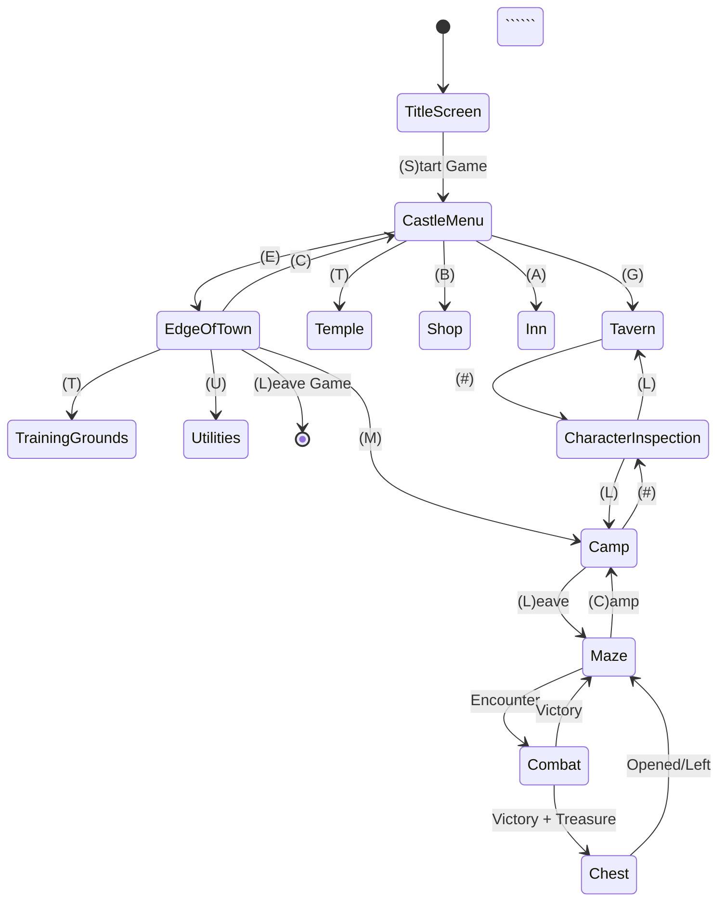

# UI Documentation Proposal

**Proposed structure for documenting Wizardry 1 user interface flow, scenes, and navigation.**

## Research Summary

Based on validation of the original Wizardry 1 interface, I've identified:
- **14 distinct scenes/screens**
- **Hub-and-spoke navigation model** (Castle as central hub)
- **Context-sensitive UI** (same screen, different actions based on location)
- **Single-keystroke interface** (minimal typing, quick navigation)
- **Hierarchical menu structure** with clear parent/child relationships

See: `/docs/research/ui-flow-validation.md` for complete research findings.

---

## Proposed Documentation Structure

### Option A: Scene-Based Documentation (Recommended)

Create individual scene documentation files organized by category:

```
/docs/ui/
├── README.md                          # UI overview and navigation map
├── scenes/
│   ├── 00-title-screen.md            # Application entry
│   ├── 01-castle-menu.md             # Central hub
│   ├── 02-training-grounds.md        # Character creation
│   ├── 03-gilgameshs-tavern.md       # Party formation
│   ├── 04-boltacs-trading-post.md    # Shop
│   ├── 05-temple-of-cant.md          # Healing/resurrection
│   ├── 06-adventurers-inn.md         # Rest and level up
│   ├── 07-edge-of-town.md            # Navigation gateway
│   ├── 08-utilities-menu.md          # System functions
│   ├── 09-camp.md                    # Pre-dungeon prep
│   ├── 10-maze.md                    # Dungeon exploration
│   ├── 11-combat.md                  # Battle interface
│   ├── 12-chest.md                   # Treasure interaction
│   └── 13-character-inspection.md    # Detail view
├── navigation-map.md                  # Visual state diagram
├── ui-patterns.md                     # Reusable UI conventions
├── state-management.md                # Application state spec
└── input-reference.md                 # Keyboard shortcuts

/docs/systems/
└── ui-system.md                       # Technical UI architecture
```

**Pros**:
- Clear separation of concerns
- Easy to find specific scene documentation
- Good for implementation reference
- Numbered files show typical user flow

**Cons**:
- More files to manage
- Need cross-references between scenes

---

### Option B: Consolidated Documentation

Create fewer, larger documents organized by function:

```
/docs/ui/
├── README.md                   # UI overview
├── town-scenes.md              # All Castle/town screens
├── dungeon-scenes.md           # Maze, Combat, Chest
├── character-scenes.md         # Training, Inspection, Formation
├── navigation-flow.md          # Complete navigation map
└── ui-specifications.md        # Technical specs
```

**Pros**:
- Fewer files
- Related scenes grouped together
- Easier to see patterns

**Cons**:
- Large files harder to navigate
- Less modular
- Harder to reference specific scenes

---

### Option C: Hybrid Approach (Flexible)

Combine both approaches with layered documentation:

```
/docs/ui/
├── README.md                   # High-level overview + navigation map
├── ui-flow-guide.md            # Complete user journey documentation
├── scenes/                     # Individual scene references
│   └── [scene-name].md        # Detailed technical specs
└── patterns/                   # Reusable components
    ├── menus.md               # Menu patterns
    ├── input.md               # Input handling
    └── feedback.md            # User feedback patterns
```

**Pros**:
- Best of both worlds
- Progressive disclosure (overview → detail)
- Good for different audiences (designers vs. developers)

**Cons**:
- Most complex to set up initially

---

## Recommended Approach: **Option A (Scene-Based)**

### Rationale

1. **Clear Implementation Path**: Each scene = one component/module
2. **Easy Reference**: Developers can quickly find "How does the Shop work?"
3. **Modular**: Scenes can be implemented independently
4. **Testable**: Each scene can have corresponding test suite
5. **Maintainable**: Updates to one scene don't affect others

---

## Scene Documentation Template

For each scene, document:

### 1. Scene Overview
```markdown
# Scene Name

## Description
[What is this scene? What is its purpose?]

## Location in Game Flow
[Where does this scene fit in the overall game structure?]

## Screenshot/Mockup
[Visual reference - can be ASCII art for now]
```

### 2. Entry Conditions
```markdown
## Entry Conditions

### From Where
- Parent Scene → (Action) → This Scene
- Example: Castle Menu → (G) → Gilgamesh's Tavern

### Requirements
- [ ] Must have at least one character created
- [ ] Party must not be "IN MAZE" status
- etc.

### State Prerequisites
```typescript
interface EntryState {
  hasCharacters: boolean
  partyInMaze: boolean
  // etc.
}
```
```

### 3. UI Layout
```markdown
## UI Layout

### Screen Regions
- Header: [Title, context info]
- Main: [Primary content]
- Menu: [Available actions]
- Status: [Party/character status]
- Messages: [Feedback, errors]

### ASCII Mockup
```
┌─────────────────────────────────────┐
│  GILGAMESH'S TAVERN                │
├─────────────────────────────────────┤
│                                     │
│  Current Party:                     │
│  1. Corak the Fighter        OK    │
│  2. Gandalf the Mage         OK    │
│  3. (empty)                         │
│  ...                                │
│                                     │
│  Gold: 500                          │
│                                     │
├─────────────────────────────────────┤
│  (A)dd                              │
│  (#)Inspect                         │
│  (R)emove                           │
│  (D)ivvy Gold                       │
│  (L)eave                            │
└─────────────────────────────────────┘
```
```

### 4. Available Actions
```markdown
## Available Actions

### (A)dd Character
**Description**: Add character to party
**Requirements**:
- Party has empty slot (< 6 members)
- Character is "OK" status
- Alignment compatible with party

**Flow**:
1. Display available characters
2. User selects character by name/number
3. Alignment check
4. Add to first empty slot
5. Update party display

**Validation**:
```typescript
function canAddCharacter(
  party: Party,
  character: Character
): { allowed: boolean; reason?: string } {
  if (party.members.length >= 6) {
    return { allowed: false, reason: "Party is full" }
  }
  if (!isAlignmentCompatible(party, character)) {
    return { allowed: false, reason: "Alignment conflict" }
  }
  return { allowed: true }
}
```

**State Changes**:
- `party.members.push(character)`
- `character.status = "IN_PARTY"`

**UI Feedback**:
- Success: "[Name] joins the party!"
- Failure: Error message
```

### 5. Navigation
```markdown
## Navigation

### Exits
| Action | Destination | Condition |
|--------|-------------|-----------|
| (L)eave | Castle Menu | Always |
| (#)Inspect | Character Inspection | Has party members |

### Parent Scene
- Castle Menu → (G) → This Scene

### Child Scenes
- This Scene → (#) → Character Inspection
```

### 6. State Management
```markdown
## State Management

### Scene State
```typescript
interface TavernState {
  party: Party              // Current party formation
  availableCharacters: Character[]
  selectedCharacterIndex: number | null
  mode: 'MAIN_MENU' | 'SELECTING_CHARACTER' | 'INSPECTING'
}
```

### Global State Changes
- Party roster modifications
- Character status updates
- Gold distribution

### Persistence
- Auto-save on party changes
- No explicit save required
```

### 7. Technical Notes
```markdown
## Implementation Notes

### Services Used
- PartyService.addMember()
- PartyService.removeMember()
- CharacterService.checkAlignment()
- ValidationService.validatePartyComposition()

### Commands
- AddToPartyCommand
- RemoveFromPartyCommand
- InspectCharacterCommand

### Edge Cases
- Adding character with incompatible alignment
- Removing last party member (should warn)
- Character in "IN MAZE" status (cannot add)
- Party at max size (6 members)
```

---

## Navigation Map Documentation

Create visual navigation map using Mermaid:

```markdown
# Navigation Map



---

## UI Patterns Documentation

Document reusable patterns:

### Menu Pattern
```markdown
## Standard Menu Pattern

All Wizardry menus follow this pattern:

1. Display location/context title
2. Display current state (party, gold, etc.)
3. Display available actions with single-letter shortcuts
4. Wait for single keystroke input
5. Execute action or show error
6. Return to menu or transition to new scene

**Visual Pattern**:
```
┌─────────────────────┐
│  LOCATION NAME      │
├─────────────────────┤
│  [State Display]    │
│                     │
├─────────────────────┤
│  (X)Action 1        │
│  (Y)Action 2        │
│  (L)eave            │
└─────────────────────┘
```

**Input Handling**:
- Single keystroke (no Enter needed)
- Case-insensitive
- First letter of action
- Invalid key = error beep/message
```

### Character Selection Pattern
```markdown
## Character Selection Pattern

Used in: Tavern, Camp, Shop, Temple, Inn

**Pattern**:
1. Display numbered list of characters (or party slots)
2. Show relevant info (name, status, HP, etc.)
3. Prompt: "Select character by number (1-N):"
4. Accept numeric input
5. Validate selection
6. Transition to action or sub-menu

**Visual Pattern**:
```
Select Character:
1. Corak the Fighter    HP: 25/30  OK
2. Gandalf the Mage     HP: 10/15  OK
3. (empty)
```
```

---

## State Management Specification

```markdown
# UI State Management

## Application State Structure

```typescript
interface ApplicationState {
  // Current scene
  currentScene: SceneType

  // Global game state
  characters: Character[]
  party: Party
  dungeon: DungeonState

  // UI state
  ui: {
    messageLog: string[]
    inputBuffer: string
    errorMessage: string | null
  }

  // Persistence
  saveData: SaveData
  autosaveEnabled: boolean
}
```

## Scene Transition Rules

1. **Validation**: Check if transition is allowed
2. **Cleanup**: Save state from current scene
3. **Transition**: Change currentScene
4. **Initialize**: Load state for new scene
5. **Render**: Display new scene

## State Persistence

**Auto-save Points**:
- Castle Menu (always safe)
- Edge of Town (L)eave Game
- After Inn/Temple transactions
- Party composition changes

**Manual Save**:
- (Q)uit from Maze
- (L)eave Game from Edge of Town
```

---

## Implementation Priority

### Phase 1: Core Navigation (Weeks 1-2)
1. Title Screen → Castle Menu
2. Castle Menu (hub)
3. Edge of Town (gateway)
4. Navigation between safe zones

### Phase 2: Town Services (Weeks 3-4)
5. Training Grounds (character creation)
6. Gilgamesh's Tavern (party formation)
7. Boltac's Trading Post (shopping)
8. Character Inspection (multi-context)

### Phase 3: Dungeon & Combat (Weeks 5-7)
9. Camp (party prep)
10. Maze (exploration)
11. Combat (battles)
12. Chest (treasure)

### Phase 4: Support Services (Week 8)
13. Temple (healing)
14. Inn (rest/level up)
15. Utilities (system functions)

---

## Documentation Deliverables

### Immediate (Week 1)
- [x] UI Flow Validation (`ui-flow-validation.md`)
- [ ] This Proposal (`ui-documentation-proposal.md`)
- [ ] UI README with navigation overview
- [ ] Scene template

### Short Term (Weeks 1-2)
- [ ] All 14 scene documentation files
- [ ] Navigation map (Mermaid diagram)
- [ ] UI patterns guide
- [ ] Input reference

### Medium Term (Weeks 3-4)
- [ ] State management specification
- [ ] UI/UX guidelines
- [ ] Component library (if applicable)
- [ ] Mockups/wireframes

---

## Questions for Discussion

1. **Visual Design**: ASCII art mockups sufficient, or need graphics?
2. **Interactivity**: Should we create interactive flowcharts?
3. **Testing**: Should scene docs include test scenarios?
4. **Responsive**: Single interface or multiple (terminal, web, mobile)?
5. **Accessibility**: Keyboard-only OK, or need mouse support?

---

## Next Steps

**Recommended**:
1. Review and approve this proposal
2. Create `/docs/ui/` directory structure
3. Start with UI README (overview + navigation map)
4. Document 2-3 example scenes (Castle, Tavern, Maze)
5. Review examples and refine template
6. Complete remaining 11 scenes
7. Create UI patterns guide
8. Create state management spec

**Estimated Effort**:
- Setup: 1 day
- Per scene: 2-3 hours
- Total: ~1 week for complete UI documentation

---

## Summary

**Recommendation**: **Option A - Scene-Based Documentation**

**Structure**:
```
/docs/ui/
├── README.md (navigation overview)
├── scenes/ (14 scene files)
├── navigation-map.md
├── ui-patterns.md
├── state-management.md
└── input-reference.md
```

**Template Sections** (per scene):
1. Overview (description, location in flow)
2. Entry Conditions (requirements, prerequisites)
3. UI Layout (mockup, regions)
4. Available Actions (detailed specs)
5. Navigation (exits, parent/child)
6. State Management (scene state, persistence)
7. Technical Notes (services, commands, edge cases)

**Benefits**:
- Clear, modular structure
- Easy to implement incrementally
- Good reference for developers
- Testable specifications
- Maintainable long-term

---

**Ready to proceed?**

I can start creating the UI documentation structure based on this proposal, beginning with:
1. `/docs/ui/README.md` - Overview and navigation map
2. `/docs/ui/scenes/01-castle-menu.md` - Example scene (central hub)
3. `/docs/ui/scenes/10-maze.md` - Example scene (dungeon exploration)

This will establish the pattern for the remaining 12 scenes.
